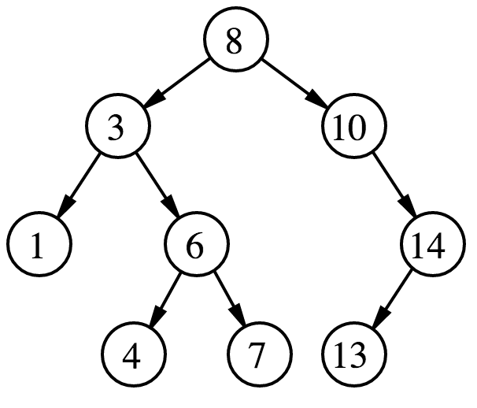
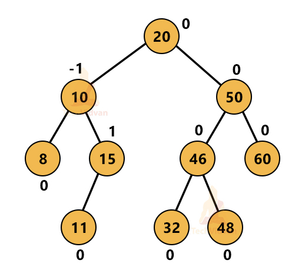
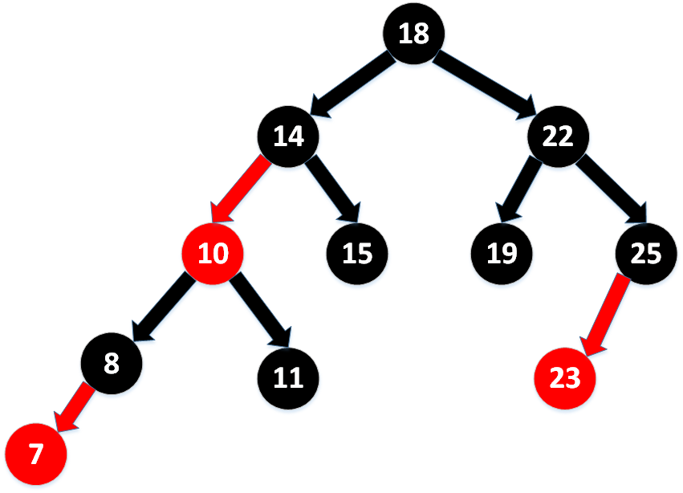
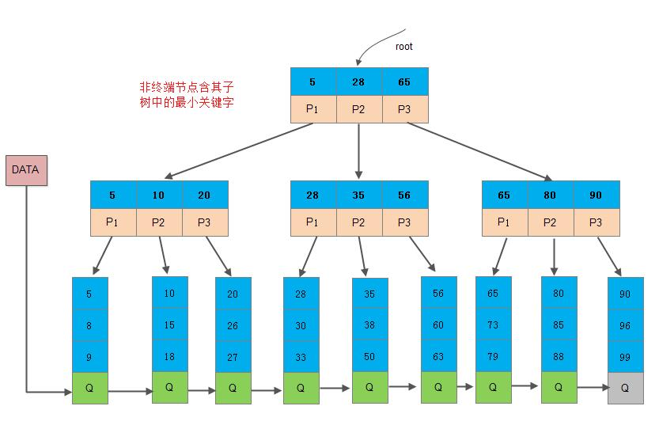

# 树
树是一种典型的分支结构，亦可以看做是一种简单的网状结构，这种结构具有单向性，没有环。

## 树的特性
树具有以下特性：
1. 树中任意两个结点之间存在唯一的路径。
2. 树中没有环。
3. 树中每个结点只有一个父结点（根结点除外）。

## 树的类型
树有很多类型，但是常见的树有：
+ **二叉树**：每个结点最多有两个子结点的树。但是在平常的使用中，二叉树的可用性质还不够，经常使用的是**二叉搜索树**。每个结点的左子树中的所有结点的值都小于该结点的值。每个结点的右子树中的所有结点的值都大于该结点的值。每个结点的值都是唯一的。
  
+ **AVL树**：一种自平衡的二叉搜索树。每个结点的左子树和右子树的高度差不能超过1。每个结点的左子树和右子树都是AVL树。根结点的高度是树的高度。
  
+ **红黑树**：红黑树是一种自平衡的二叉搜索树。每个结点要么是红色，要么是黑色。根结点是黑色。每个叶子结点是黑色。每个红色结点的两个子结点都是黑色。从任意一个结点到其所有叶子结点的路径中，黑色结点的个数相同。为了强化对于结构的要求，有时还会要求，红色节点只能是其父节点的左子节点，称为**左倾红黑树**。
  
+ **B树**：一种多叉搜索树。每个结点最多有m个子结点（m>=2）。每个结点的子结点个数在[m/2]和m之间（根结点除外）。根结点的子结点个数在2和m之间。每个结点的所有子结点的高度相同。每个结点的所有子结点的值都大于该结点的值。每个结点的值都是唯一的。为了能够方便对B树上的结构进行遍历，还出现了**B+树**，它是B树的变种，它的所有的数据均位于叶子结点，当然中间结点也存放着边界节点的数据。
  

还有一些特殊用途的树：
+ **Trie树**。也叫**前缀树**、**单词查找树**、**字典树**。
+ **后缀树**。
+ **表达式树**。
+ **Huffman树**。
+ **线段树**。
+ **并查集**

## 树的建构
树的建构可以通过以下步骤来实现：
1. 选择一个根结点作为树的根。
2. 将其他结点与根结点连接，形成树的分支结构。
3. 确保每个结点只有一个父结点，避免形成环。

## 树的遍历
树的遍历是指访问树中每个结点的过程。常见的树遍历算法包括：以二叉树为例
+ 前序遍历：先访问根结点，然后访问左子树，最后访问右子树。
  ```js
  function preorderTraversal(node) {
    if (node === null) return;
    console.log(node.value); // 访问根节点
    preorderTraversal(node.left); // 前序遍历左子树
    preorderTraversal(node.right); // 前序遍历右子树
  }
  ```
+ 中序遍历：先访问左子树，然后访问根结点，最后访问右子树。
  ```js
  function inorderTraversal(node) {
    if (node === null) return;
    inorderTraversal(node.left); // 中序遍历左子树
    console.log(node.value); // 访问根节点
    inorderTraversal(node.right); // 中序遍历右子树
  }
  ```
+ 后序遍历：先访问左子树，然后访问右子树，最后访问根结点。
  ```js
  function postorderTraversal(node) {
    if (node === null) return;
    postorderTraversal(node.left); // 后序遍历左子树
    postorderTraversal(node.right); // 后序遍历右子树
    console.log(node.value); // 访问根节点
  }
  ```
+ 层序遍历：从根结点开始，逐层访问树中的结点
  ```js
  function levelOrderTraversal(root) {
    if (!root) return;
    const queue = [root];
    while (queue.length > 0) {
        const node = queue.shift(); // 出队
        console.log(node.value); // 访问节点
        if (node.left) queue.push(node.left); // 左子节点入队
        if (node.right) queue.push(node.right); // 右子节点入队
    }
  }
  ```
- 前三种是dfs，后一种是bfs。

## 树的操作
树的操作包括：
+ 插入：向树中插入一个新结点。
+ 删除：从树中删除一个结点。
+ 查询：在树中查找一个结点。
