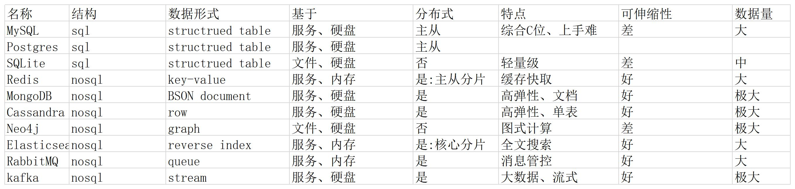

# 数据库

数据库是用于存储、管理和检索数据的系统。在现代应用开发中，数据库扮演着至关重要的角色，是数据持久化的核心组件。

## 主流数据库对比

### 关系型数据库（RDBMS）
1. **MySQL**
   - 开源关系型数据库
   - 广泛用于Web应用
   - 支持事务和ACID特性
   - 适合OLTP（联机事务处理）
   - 社区版免费，企业版收费

2. **PostgreSQL**
   - 功能强大的开源数据库
   - 支持复杂查询和自定义类型
   - 提供JSON支持
   - 适合复杂的数据分析
   - 完全开源，功能丰富

3. **SQLite**
   - 轻量级嵌入式数据库
   - 零配置
   - 适合移动应用和桌面应用
   - 单文件存储
   - 无需服务器

4. **Oracle**
   - 企业级数据库
   - 高性能和高可用性
   - 丰富的企业特性
   - 适合大型企业应用
   - 商业软件，价格昂贵

### NoSQL数据库
1. **MongoDB**
   - 文档型数据库
   - 灵活的数据模型
   - 适合快速开发
   - 支持复杂查询
   - 社区版免费，企业版收费

2. **Redis**
   - 内存数据库
   - 键值存储
   - 支持多种数据结构
   - 适合缓存和会话存储
   - 开源免费

3. **Cassandra**
   - 列式数据库
   - 高可扩展性
   - 适合大数据应用
   - 分布式架构
   - 开源免费

4. **Neo4j**
   - 图数据库
   - 适合关系型数据
   - 支持复杂图查询
   - 适合社交网络分析
   - 社区版免费，企业版收费

## 数据库选择建议

### 选择关系型数据库的场景
1. 需要强一致性
2. 数据结构相对固定
3. 需要复杂的事务支持
4. 需要复杂的查询和连接操作

### 选择NoSQL数据库的场景
1. 需要高可扩展性
2. 数据结构灵活多变
3. 需要高性能读写
4. 处理大量非结构化数据

## 相关文档

- [SQL基础语法](sql.md)
- [数据库设计与范式](nf.md)
- [数据库索引](id.md)

