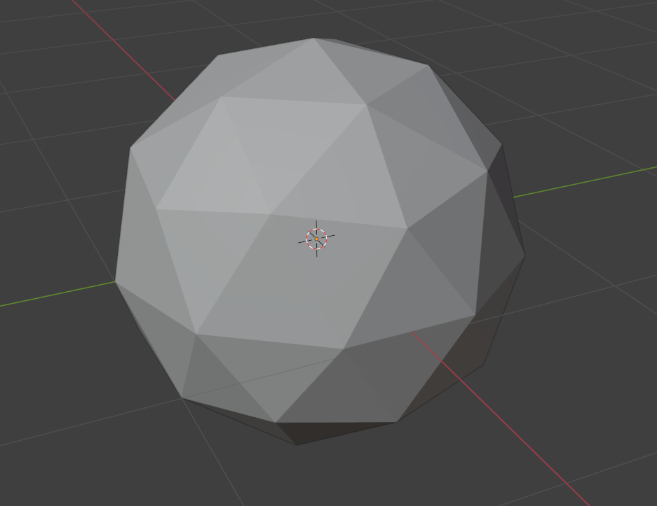

# 3D 场景渲染
2D 图像渲染和 3D 场景渲染之间，存在着非常巨大的原理性差异，2D 图像的显示符合计算机屏幕的呈现方式，因为屏幕本来就是 2D 的，呈现 2D 的平面图像数据非常直接。然而对于 3D 场景渲染便不是那么的简单了，其复杂度非常高，包含了 3 个基本的要素，**场景、灯光和相机**，通过控制 3 要素之间的关系，同时经过大量的处理步骤，最终将 3D 场景转化为 2D 图形后再呈现在计算机屏幕上。

## 3D 表达
3D 场景的表达方式可以有：
+ 显式几何。通过直接定义物体的顶点、边、面等几何元素来描述形状，通常以参数化形式或网格形式表示，如三角形网格。
+ 隐式几何：如球体 `x^2 + y^2 + z^2 = r^2` 或复杂曲面。
+ 体视素：如体视显微镜中的体数据。
+ 其他：如分形、程序化几何。

其中显示几何方法三角面网格表达是目前最为广泛使用的表达形式，业界有较为成熟的实践。

### 三角形网格
一个 3D 场景是一个空间坐标系。在坐标系中，使用一个 3 维向量或者坐标，来表示一个点，例如：`P(x, y, z)`。然后，通过声明一组 3 个点组成的关系代表一个空间中的三角形面。而一个 3D 模型，又是由若干个三角面包围形成的空间体，该空间体一般是**空间闭合**的。

三角面区分正反面，一般的，逆时针连接顺序是正面，顺时针连接为反面。何为正反面？对于一个闭合的空间体，从外面可以看见哪个面便是正面，朝向内部，从外面看不见的便是反面。三角面的法向量以逆时针定义，代表正面。

## 渲染管线
渲染管线是指将 3D 场景的源数据转化为 2D 图片的过程，由于其包含大量的计算工作量，人们采用了批量化处理的手段，将这一过程分为多个步骤的流水线化处理，因此被形象地称为渲染管线。渲染管线和图形 API 和 GPU 高度绑定，不同的 GPU 和图形 API 提供了不同的编程接口，但是基础的原理大致相似。

目前，根据渲染管线使用的算法原理的不同，渲染管线主要有两种：**光栅化管线**和**光线追踪管线**。前者使用空间变换和近似光照模型绘制图像，后者通过模拟光线路径和光线散射模型生成拟真的图像效果。

同时，近年 AIGC 技术的兴起，AI 绘图也在逐步发展，AI 绘图使用的原理是完全不同于两种管线的方式，也是未来发展的重要思路。
