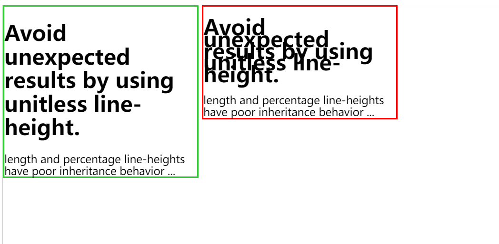

# CSS

## 层叠性

## 选择性

## 继承性

某些 CSS 属性会自动从父元素传递到子元素，而无需在子元素中显式定义。这种行为被称为继承。继承属性通常与文本和字体相关。

### 常见的自动继承的属性：

- 文本相关属性：color, font-family, font-size, font-style, font-variant, font-weight, line-height, text-align, text-indent, text-transform, visibility, white-space, word-spacing, letter-spacing
- 列表属性：list-style-type, list-style-position, list-style-image
- 表格属性：border-collapse, border-spacing, caption-side, empty-cells, table-layout

### 常见的不继承的属性：

- 盒模型属性：margin, padding, border, width, height
- 布局属性：position, top, right, bottom, left, z-index, display, float, clear
- 背景属性：background-color, background-image, background-position, background-repeat, background-size

### 显式控制继承性

使用全局 CSS 常量 inherit、initial、unset 来对相应的属性进行设置即可。

- inherit。要继承
- initial。不继承
- unset。如果属性原本是可继承的，则表现为 inherit，如果原本不是可继承的，则表现为 initial

### 注意
在 CSS 继承时，继承的是父元素的计算值，而不是继承 CSS 属性的指定值。
例如，一个父元素的字体大小为 16px，那么它的子元素通过指定 1.5em 的字体大小，则其计算值为 24px，而孙元素指定字体大小为 inherit，则继承父元素的字体大小 24px，如果孙元素指定其字体大小为 1.5em，其实际的字体大小将为 36px，这是因为继承的值是计算值而不是指定值。
而 line-height 为了提供稳定的行为，相对于元素自身的字体大小，而提供了纯数值的形式，这样可保证不受继承性的影响，推荐在设置 line-height 时使用无单位数值。如下为 MDN 上给的 demo。

```html
<div class="box green">
  <h1>Avoid unexpected results by using unitless line-height.</h1>
  length and percentage line-heights have poor inheritance behavior ...
</div>

<div class="box red">
  <h1>Avoid unexpected results by using unitless line-height.</h1>
  length and percentage line-heights have poor inheritance behavior ...
</div>
```

```css
.green {
  line-height: 1.1;
  border: solid limegreen;
}

.red {
  line-height: 1.1em;
  border: solid red;
}

h1 {
  font-size: 30px;
}

.box {
  width: 18em;
  display: inline-block;
  vertical-align: top;
  font-size: 15px;
}
```



## 属性计算
对于任意一个元素，从 CSS 源码到最终的元素属性，需要经过多个步骤，并且最终为每一个 CSS 属性计算出值，不得为空。因此，CSS 属性值分为三个阶段：**指定值、计算值和实际值**。

+ 指定值说的是在代码中书写的 CSS 规则，它可以有很多个。
+ 计算值是指浏览器根据多个 CSS 规则计算出来的值，其中还要包括对于继承的属性的计算，计算值是一个精确的绝对单位的值，只有一个，例如：所有的长度和尺寸相关的 CSS 属性最终都会变成一个具体的指定具体的多少 `px`。
+ 实际值还会考虑真正绘制到屏幕上时元素的真实效果，这个真实效果可能受到布局、显示、特效、动画的影响，从计算值到实际还需要经过实际的渲染，这个值是最终呈现在屏幕上的效果。

### 计算过程
1. 声明，扫描和解析所有 css 源码，为该元素初始化已经被声明的属性
2. 层叠
   如果某个属性出现了多次，被重复声明和定义，那么，需要先进行重要性校验；一般地，
   ```
   !important 修饰的浏览器样式 > !important 修饰的作者样式 > 普通作者样式 > 普通浏览器样式
   ```
   然后，对于同一类的样式，根据选择性的 Specificity 高低来决定谁被采用；
3. 继承，如果元素的某个属性没有被声明，那么看这个属性是否是一个可继承的属性，如果是，那么就是从父元素进行继承；

4. 默认，如果一个属性依然没有值那么则使用 W3 标准中定义的默认值。