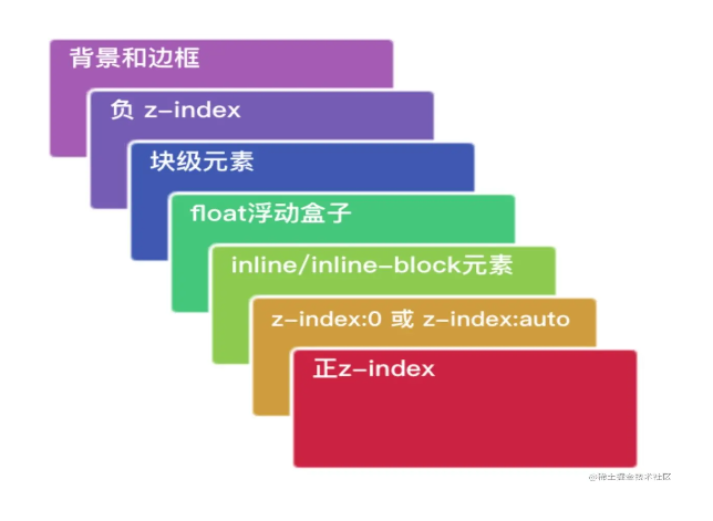

# 层叠上下文与 z-index

两个元素的图层决定着元素显示的上下关系，上层的元素将覆盖下层的元素进行显示。决定图层关系的 CSS 属性为 z-index，z-index 越大，元素的显示优先级越高。

## z-index 比较方法

- 首先先看要比较的两个元素是否处于同一个 SC 中，如果是，谁的层叠等级大，谁在上面；
- 如果两个元素不在同一 SC 中，先比较他们的父 SC，当两个元素层叠水平相同、层叠顺序相同时，在 DOM 结构中后面的元素层叠等级在前面元素之上；
- 如果一个元素拥有 CS 则在普通元素之上

普通的元素层级如图示：

## 层叠上下文的产生

层叠上下文的创建有两种情况，一种是强制创建，一种是可选创建。

- 强制创建：
  1. 文档的根元素，如 html；
  2. position 设置为 fix、sticky；
  3. opacity < 1；
  4. mix-blend-mode 不为 normal；
  5. isolation=isolate；
  6. 使用了 CSS3 的动画特性，例如：filter、transform、will-change、clip-path……
- 可选创建：指定 z-index 不为 auto；在此基础上，z-index 的
  1. position 设置为 relative、absolute；
  2. flexbox 和 grid 的子元素；另外，position 不为 none 的时候同时会创建一个偏移上下文。
