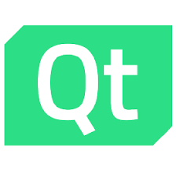
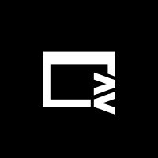
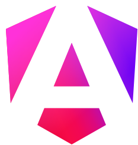

# UI 框架
UI 框架是在渲染引擎的上一层或者平台 UI 控件库的上一层工作的软件库。UI 框架存在的意义主要体现在，
+ 封装下层的低级 API，为上层提供更方便的声明式 API；
+ 提供复杂组件和高级渲染效果等；
+ 提供跨平台能力；

- Electron，包揽了大部分的中低端领域 PC 端 GUI 开发市场，开发速度快、界面美观、招人容易、跨平台一致性好、差异性也好，但是作为 Web 技术架构的 GUI 技术，其缺点自然是继承了 Web GUI 应用的几乎所有缺点；
- Qt，主要在嵌入式和高性能软件领域等高端领域，碍于 C++本身的难度和开发效率问题，在很多时候，项目进行选型的时候，开发人员和项目管理者往往本着能不用 C++就不用 C++的宗旨；另外，C++的开发环境基础设施与其他语言相比，堪称简陋，开发体验较差；

二者主要适用于 PC 端，对于移动端的支持不太行，移动端主要选手还是 Flutter。
- ReactNative，移动端优先选手，使用 JS 和 React 框架编写，使用 Facebook 自己封装的跨平台组件进行 UI 声明。生态成熟，在 Flutter 出现之前的首选方案。

**未来可期**

- Flutter。Flutter 是目前最未来可期的 UI 技术，使用自绘制架构，保证高性能和跨平台的 UI 一致性，重写的底层引擎 Impeller，旨在解决 Flutter 应用的“Early-onset jank”问题，同时为 Flutter 应用提供更高的定制性和性能。通过自绘制引擎，Flutter 完成了全平台跨端的能力。但是，没有选择 JavaScript 而使用 Dart 语言是 Flutter 的痛点，Dart 语言注定会阻止一部分先入为主的人。不过，选择 Dart 也是一次新生，Dart 的语言特性相较于 JavaScript 更好，没有 JavaScript 身上的一些历史遗留问题。
- Tauri。Tauri 可以看做是为 rust 程序员使用的 GUI 框架。不过它本身的优势确实也是非常明显的，其包体积很小，利用操作系统的原生浏览器内核，同时使用 rust 做后端，也能在后端的方面提供非常强悍的性能，将耗时任务交给 rust，可以在一定程度上解决 Electron 的 js 速度慢的问题。不过，tauri 带来了新的问题，就是又把 Electron 抹平的 Web 兼容性问题带回来了。这样，书写 tauri 既要很高的 Web 前端水平，又要学习 rust，那么这样的框架自身也是很劝退的。tauri 对于移动端的适配是板上钉钉的，它可以带来 Electron 不想干的功能。随着 rust 在前端领域的渗透，如果 rust 能招致越来越多的前端人去学习，那么届时，tauri 也将成为一个新的领军框架。

| Electron                    | Flutter                   | Tauri                 | Qt              |
| --------------------------- | ------------------------- | --------------------- | --------------- |
|  |  |  |  |

补充一些 web 套壳技术。

- capacitor，移动端 web 套壳技术。这是一个移动端的 web 容器，相当于移动端的 Electron，使用 web 技术进行移动端开发，同时提供丰富的插件，可以调用移动端的功能。
- neutralino，桌面端 web 套壳技术。桌面端超轻量 web 套壳，用于满足非常小的桌面应用需求。
- webview，C库，用于在桌面端嵌入 web 技术，可以用于开发桌面端应用，但是其功能非常有限，只能用于嵌入 web 技术，不能提供丰富的插件，也不能调用桌面端的功能。

| Capacitor                   | Neutralino                    | Webview                 |
| --------------------------- | ----------------------------- | ----------------------- |
|  |  |  |

## Web 框架
随着 Web 技术的功能和性能日益强大，且得益于 Web 技术本身与操作系统无关的特性，反而在社区中慢慢形成一种使用浏览器套壳的应用的风气，这种应用的性能不算好，需要臃肿的运行时环境、运行速度和效率不高、软件功能和权限受到平台局限……我们不好评价这种做法，但是这确实是开发者的无奈妥协。Web 应用是唯一能够在保持开发速度、一致性和差异性处理上满足横跨 PC、移动端的 GUI 方案。其他的方案目前或多或少存在着问题。

当下的 Web 框架主要是 React 和 Vue，呈现出一大一中群小的局面，React 占据了生态中的大部分，Vue 其次，其他的框架占据的份额很小。

- React。一大
- Vue。一中。
- Angular。使用面向对象、依赖注入、装饰器等技术进行开发，大而全。在 React hooks 横空出世后，人们逐渐发现了 Web 前端 UI 开发时灵活性的重要性，而面向对象的传统思路，加上在 js 中`this`是个毒瘤，面向对象的编程风格逐步被函数编程风格所侵蚀，而使用面向对象的编程风格的 Angular 就显得自由度太低，灵活性差，开发速度慢，框架笨重，性能也不行，份额持续减少，社区中也出现了很多劝退的声音。Angular 的出路在于做减法，不断地减少框架自身的冗余设计，降低开发者的心智负担，提供更加自由、灵活、方便的开发体验。而在后续的版本更新中，Angular 引入了关键的 Signal 机制，提高了开发效率的同时，大幅提升了性能。
- Svelte。2016 年首发，2019 年稳定的新兴框架，提出了无虚拟 dom 的架构，不生成运行时，使用和 vue 相似的单文件编译方式，拥有强悍的性能，较小的内存占用和较小的打包体积。但是，随着项目规模的不断扩大，其打包体积会越来越膨胀，最终丧失在打包体积方面的优势，反而变成劣势。
- Solid。2018 年首发，2020 年稳定的新兴框架，究极框架缝合怪，是一个非常年轻的框架，汲取市面上很多前端框架之长。Solid 在语法上使用了 React 的 jsx 语法，在架构上使用了 Svelte 的无虚拟 dom 的原生操作，在响应式方面参考了 konckout.js，同时能够集成 mobx 和 vue 的响应式系统……前端框架性能之王，同时兼顾速度、内存、打包体积的全能选手。唯一的缺点就是，用的人太少，生态不行。

| react                 | vue               | angular                   | svelte                  | solid                 |
| --------------------- | ----------------- | ------------------------- | ----------------------- | --------------------- |
|  |  |  |  |  |

### 其他框架

- lit。面向 Web Component 的前端框架，使用原生 Web Component 来进行组件化的框架。
- Astro。提出了“孤岛架构”，拥有优秀的页面加载性能
- Vitepress。
- Docusaurus。

## 分平台选择
| tier | Windows      | MacOS         | Linux        | Android        | IOS            |
| ---- | ------------ | ------------- | ------------ | -------------- | -------------- |
| 1    | C#/WinUI     | Swift/SwiftUI | C/GTK        | Kotlin/Compose | Swift/SwiftUI  |
| 2    | C#/Avalonia  | JS/Electron   | C++/Qt       | Dart/Flutter   | Dart/Flutter   |
| 3    | JS/Electron  | Dart/Flutter  | JS/Electron  | JS/ReactNative | JS/ReactNative |
| 4    | Dart/Flutter | Rust/Tauri    | Dart/Flutter | Rust/Tauri     | Rust/Tauri     |
| 5    | Rust/Tauri   | C++/Qt        | Rust/Tauri   |                |                |
| 6    | C++/Qt       |               |              |                |                |

ps:
+ C#/Avalonia 是 C#/WPF 的现代版开源替换，而 C#/WPF 又是 C#/WinForms 的上位替代，因此这些方案最终归于一尊。C#/MAUI 是微软开的新坑，主打跨平台，但是考虑到微软经常烂尾，所以不考虑这个框架。对于 C# 来说，全票梭哈开源的 Avalonia。
+ Qt 是老牌跨平台 GUI 框架，但是，一方面在于其商业许可的问题，这一点非常致命；另一个是 C++ 在 GUI 领域的份额已经被其他新型语言和框架逐步蚕食，趋势不可逆转，对该框架整体看衰；
+ Dart/Flutter 在桌面端还不是太成熟，但是未来一片光明，对该框架整体看好。
+ Linux 平台下的默认浏览器依然欠优化。

### 嵌入式平台选择
嵌入式平台根据各种设备的[性能规格](/kernel/embed/)有较大的差异：

| 裸机级 | RTOS 级    | 嵌入式 Linux 级 | Linux 级     |
| ------ | ---------- | --------------- | ------------ |
| 无 UI  | C/LVGL     | C++/Qt          | C/GTK        |
| 自绘制 | C/TouchGFX | Rust/Slint      | C++/Qt       |
| C/μGUI |            | Rust/egui       | Dart/Flutter |
|        |            | Rust/iced       | Rust/Tauri   |
|        |            |                 | JS/Electron  |

## 分语言选择
| 语言       | 移动端             | 桌面端       | 嵌入式                | 跨平台        |
| ---------- | ------------------ | ------------ | --------------------- | ------------- |
| JavaScript | ReactNative,Uniapp | Electron     | Web                   | Web           |
| Dart       | Flutter            | Flutter      | Flutter               | Flutter       |
| Rust       | Tauri,iced         | Tauri,iced   | Tauri,slint,iced,egui | Tauri,iced    |
| C#         | MAUI,Avalonia      | Avalonia     | Avalonia              | Avalonia,MAUI |
| C++        | Qt                 | Qt,DearImGUI | Qt                    | Qt            |
| C          | -                  | GTK          | LVGL,TouchGFX         | -             |
| Python     | PyQt               | PyQt         | Tkinter,PyQt          | PyQt          |

总体来说，未来在 GUI 领域，除了原生语言在各家的平台有一席之地，跨平台领域就是 JavaScript、Dart 和 Rust 的天下。

