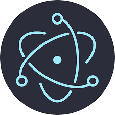
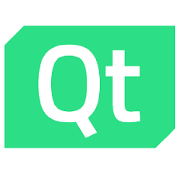
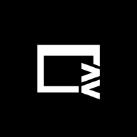
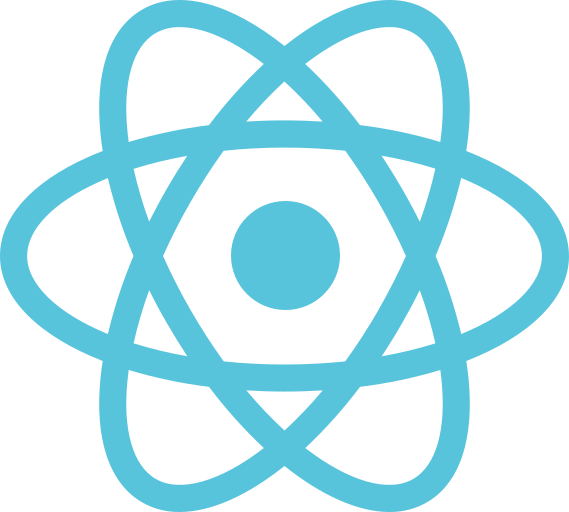
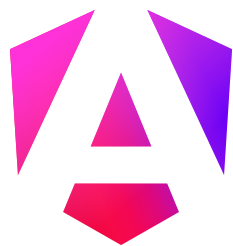

# UI 框架
UI 框架是在渲染引擎的上一层或者平台 UI 控件库的上一层工作的软件库。UI 框架存在的意义主要体现在，
+ 封装下层的低级 API，为上层提供更方便的声明式 API；
+ 提供复杂组件和高级渲染效果等；
+ 提供跨平台能力；

- Electron，包揽了大部分的中低端领域 PC 端 GUI 开发市场，开发速度快、界面美观、招人容易、跨平台一致性好、差异性也好，但是作为 Web 技术架构的 GUI 技术，其缺点自然是继承了 Web GUI 应用的几乎所有缺点；
- Qt，主要在嵌入式和高性能软件领域等高端领域，碍于 C++本身的难度和开发效率问题，在很多时候，项目进行选型的时候，开发人员和项目管理者往往本着能不用 C++就不用 C++的宗旨；另外，C++的开发环境基础设施与其他语言相比，堪称简陋，开发体验较差；

二者主要适用于 PC 端，对于移动端的支持不太行，移动端主要选手还是 Flutter。
- ReactNative，移动端优先选手，使用 JS 和 React 框架编写，使用 Facebook 自己封装的跨平台组件进行 UI 声明。生态成熟，在 Flutter 出现之前的首选方案。

**未来可期**

- Flutter。Flutter 是目前最未来可期的 UI 技术，使用自绘制架构，保证高性能和跨平台的 UI 一致性，重写的底层引擎 Impeller，旨在解决 Flutter 应用的“Early-onset jank”问题，同时为 Flutter 应用提供更高的定制性和性能。通过自绘制引擎，Flutter 完成了全平台跨端的能力。但是，没有选择 JavaScript 而使用 Dart 语言是 Flutter 的痛点，Dart 语言注定会阻止一部分先入为主的人。不过，选择 Dart 也是一次新生，Dart 的语言特性相较于 JavaScript 更好，没有 JavaScript 身上的一些历史遗留问题。
- Tauri。Tauri 可以看做是为 rust 程序员使用的 GUI 框架。不过它本身的优势确实也是非常明显的，其包体积很小，利用操作系统的原生浏览器内核，同时使用 rust 做后端，也能在后端的方面提供非常强悍的性能，将耗时任务交给 rust，可以在一定程度上解决 Electron 的 js 速度慢的问题。不过，tauri 带来了新的问题，就是又把 Electron 抹平的 Web 兼容性问题带回来了。这样，书写 tauri 既要很高的 Web 前端水平，又要学习 rust，那么这样的框架自身也是很劝退的。tauri 对于移动端的适配是板上钉钉的，它可以带来 Electron 不想干的功能。随着 rust 在前端领域的渗透，如果 rust 能招致越来越多的前端人去学习，那么届时，tauri 也将成为一个新的领军框架。

| Electron                    | Flutter                   | Tauri                 | Qt              |
| --------------------------- | ------------------------- | --------------------- | --------------- |
|  |  |  |  |

补充一些 web 套壳技术。

- capacitor，移动端 web 套壳技术。这是一个移动端的 web 容器，相当于移动端的 Electron，使用 web 技术进行移动端开发，同时提供丰富的插件，可以调用移动端的功能。
- neutralino，桌面端 web 套壳技术。桌面端超轻量 web 套壳，用于满足非常小的桌面应用需求。
- webview，C库，用于在桌面端嵌入 web 技术，可以用于开发桌面端应用，但是其功能非常有限，只能用于嵌入 web 技术，不能提供丰富的插件，也不能调用桌面端的功能。

| Capacitor                   | Neutralino                    | Webview                 |
| --------------------------- | ----------------------------- | ----------------------- |
|  |  |  |

## Web 框架
随着 Web 技术的功能和性能日益强大，且得益于 Web 技术本身与操作系统无关的特性，反而在社区中慢慢形成一种使用浏览器套壳的应用的风气，这种应用的性能不算好，需要臃肿的运行时环境、运行速度和效率不高、软件功能和权限受到平台局限……我们不好评价这种做法，但是这确实是开发者的无奈妥协。Web 应用是唯一能够在保持开发速度、一致性和差异性处理上满足横跨 PC、移动端的 GUI 方案。其他的方案目前或多或少存在着问题。

当下的 Web 框架主要是 React 和 Vue，呈现出一大一中群小的局面，React 占据了生态中的大部分，Vue 其次，其他的框架占据的份额很小。

- React。一大
- Vue。一中。
- Angular。使用面向对象、依赖注入、装饰器等技术进行开发，大而全。在 React hooks 横空出世后，人们逐渐发现了 Web 前端 UI 开发时灵活性的重要性，而面向对象的传统思路，加上在 js 中`this`是个毒瘤，面向对象的编程风格逐步被函数编程风格所侵蚀，而使用面向对象的编程风格的 Angular 就显得自由度太低，灵活性差，开发速度慢，框架笨重，性能也不行，份额持续减少，社区中也出现了很多劝退的声音。Angular 的出路在于做减法，不断地减少框架自身的冗余设计，降低开发者的心智负担，提供更加自由、灵活、方便的开发体验。而在后续的版本更新中，Angular 引入了关键的 Signal 机制，提高了开发效率的同时，大幅提升了性能。
- Svelte。2016 年首发，2019 年稳定的新兴框架，提出了无虚拟 dom 的架构，不生成运行时，使用和 vue 相似的单文件编译方式，拥有强悍的性能，较小的内存占用和较小的打包体积。但是，随着项目规模的不断扩大，其打包体积会越来越膨胀，最终丧失在打包体积方面的优势，反而变成劣势。
- Solid。2018 年首发，2020 年稳定的新兴框架，究极框架缝合怪，是一个非常年轻的框架，汲取市面上很多前端框架之长。Solid 在语法上使用了 React 的 jsx 语法，在架构上使用了 Svelte 的无虚拟 dom 的原生操作，在响应式方面参考了 konckout.js，同时能够集成 mobx 和 vue 的响应式系统……前端框架性能之王，同时兼顾速度、内存、打包体积的全能选手。唯一的缺点就是，用的人太少，生态不行。

| react                 | vue               | angular                   | svelte                  | solid                 |
| --------------------- | ----------------- | ------------------------- | ----------------------- | --------------------- |
|  |  |  |  |  |

### 其他框架
- lit。面向 Web Component 的前端框架，使用原生 Web Component 来进行组件化的框架。
- Astro。提出了“孤岛架构”，拥有优秀的页面加载性能
- Vitepress。
- Docusaurus。

## 分平台选择
| tier | Windows      | MacOS         | Linux        | Android        | IOS            |
| ---- | ------------ | ------------- | ------------ | -------------- | -------------- |
| 1    | C#/WinUI     | Swift/SwiftUI | C/GTK        | Kotlin/Compose | Swift/SwiftUI  |
| 2    | C#/Avalonia  | JS/Electron   | C++/Qt       | Dart/Flutter   | Dart/Flutter   |
| 3    | JS/Electron  | Dart/Flutter  | JS/Electron  | JS/ReactNative | JS/ReactNative |
| 4    | Dart/Flutter | Rust/Tauri    | Dart/Flutter | Rust/Tauri     | Rust/Tauri     |
| 5    | Rust/Tauri   | C++/Qt        | Rust/Tauri   |                |                |
| 6    | C++/Qt       |               |              |                |                |

ps:
+ C#/Avalonia 是 C#/WPF 的现代版开源替换，而 C#/WPF 又是 C#/WinForms 的上位替代，因此这些方案最终归于一尊。C#/MAUI 是微软开的新坑，主打跨平台，但是考虑到微软经常烂尾，所以不考虑这个框架。对于 C# 来说，全票梭哈开源的 Avalonia。
+ Qt 是老牌跨平台 GUI 框架，但是，一方面在于其商业许可的问题，这一点非常致命；另一个是 C++ 在 GUI 领域的份额已经被其他新型语言和框架逐步蚕食，趋势不可逆转，对该框架整体看衰；
+ Dart/Flutter 在桌面端还不是太成熟，但是未来一片光明，对该框架整体看好。
+ Linux 平台下的默认浏览器依然欠优化。

### 嵌入式平台选择
嵌入式平台根据各种设备的[性能规格](/kernel/embed/)有较大的差异：

| 裸机级 | RTOS 级    | 嵌入式 Linux 级 | Linux 级     |
| ------ | ---------- | --------------- | ------------ |
| 无 UI  | C/LVGL     | C++/Qt          | C/GTK        |
| 自绘制 | C/TouchGFX | Rust/Slint      | C++/Qt       |
| C/μGUI |            | Rust/egui       | Dart/Flutter |
|        |            | Rust/iced       | Rust/Tauri   |
|        |            |                 | JS/Electron  |

## 分语言选择
| 语言       | 移动端             | 桌面端       | 嵌入式                | 跨平台        |
| ---------- | ------------------ | ------------ | --------------------- | ------------- |
| JavaScript | ReactNative,Uniapp | Electron     | Web                   | Web           |
| Dart       | Flutter            | Flutter      | Flutter               | Flutter       |
| Rust       | Tauri,iced         | Tauri,iced   | Tauri,slint,iced,egui | Tauri,iced    |
| C#         | MAUI,Avalonia      | Avalonia     | Avalonia              | Avalonia,MAUI |
| C++        | Qt                 | Qt,DearImGUI | Qt                    | Qt            |
| C          | -                  | GTK          | LVGL,TouchGFX         | -             |
| Python     | PyQt               | PyQt         | Tkinter,PyQt          | PyQt          |

总体来说，未来在 GUI 领域，除了原生语言在各家的平台有一席之地，跨平台领域就是 JavaScript、Dart 和 Rust 的天下。

## UI 框架成熟度评判维度
选框架不能只看"谁更快"或"谁更火"。以 Web 前端（HTML/CSS/JS + React/Vue 生态）作为基准标尺——这是经过二十年演进、在开发体验上最完备的参照系——可以将 UI 框架的评判拆解为多个正交维度。这些维度不是"越多越好"——不同项目对维度的权重分配完全不同。一个嵌入式温控器面板和一个企业 SaaS 后台需要的框架，在同一个维度上可能有相反的取舍。

### 多维度评估体系
**渲染能力与性能**：GPU 加速级别、帧率稳定性、渲染管线是否自研还是依赖平台控件。自绘制引擎（Flutter Impeller、Qt、iced 的 wgpu）跨平台一致性好但需要自己解决平台适配；平台原生控件（SwiftUI、WinUI）性能最优但跨平台零分。Web 的 Canvas/WebGL 经多年优化能稳住 60fps，但内存基线高（Electron 空壳 ~150MB，原生壳 ~10-40MB）。

**语法与范式**：声明式还是命令式、UI 代码与业务逻辑的关系、状态管理的内置程度。JSX（React/Solid）和 Vue SFC 是当前声明式最成熟的两个方向。Flutter 的嵌套 widget 树在深层嵌套时难以阅读。Elm 架构（iced）中心化状态，类型安全但样板多。即时模式（egui、Dear ImGui）代码最少但性能上限低于保留模式。范式本身无优劣——但生态分裂（如 Rust 同时存在 Elm、即时、DSL、Signals 四种范式）会增加学习成本和切换框架的摩擦。

**样式与布局**：布局引擎能力（Flexbox/Grid/绝对定位）、声明样式的便利性、主题系统。Web 的 CSS + TailwindCSS 是满分基准——样式与结构分离、媒体查询、伪类、动画全部在统一的属性系统中。Flutter 的 `Container(padding: ..., margin: ...)` 链式调用直观但深层嵌套时定位属性源头困难。Qt 的 QSS 是 CSS 子集但调试不便。原生框架（iced/egui）的样式能力最弱——布局靠链式调用或 DSL，一个"带模糊阴影 + Hover 缩放的卡片"可能需要手写 Canvas 绘制。

**组件库生态**：开箱即用的高阶组件数量和质量——表格、树形视图、日期选择器、富文本编辑器、图表。Web 的 AntD/Shadcn UI/MUI 有成百上千生产级组件。Flutter 的 pub.dev 组件生态紧随其后。Qt 的 QWidget 丰富但外观陈旧。Rust 原生 UI 是最大的短板——仅提供 Button/Text 等原子组件，iced_aw 的丰富度相当于 Web 十年前。组件库的丰富度直接决定开发速度——从零写一个带筛选排序的树形表格需要对框架和 Canvas 的深入理解，而 Web 开发者在 npm install 后 10 分钟就能接入。

**开发体验与工具链**：热重载速度、DevTools/Inspector、调试能力、错误提示质量。Web 的"改 CSS → 50ms 局部刷新"和 F12 Elements Inspector 是黄金标准。Flutter 的 Hot Reload（毫秒级）和 DevTools widget inspector 紧随其后。Qt Creator 的 Designer 拖拽方式对简单 UI 效率高但复杂交互力不从心。编译型语言（Rust/C++）即使增量编译也要 2-5 秒，反馈回路延迟拖垮 UI 调优节奏。

**打包与分发**：二进制体积、依赖管理、安装体验、自动更新。Rust 和 Go 产出单一静态二进制——无运行时依赖、复制即运行——是打包的满分。Flutter 的 release 构建约 10-30MB（移动端）到 50-100MB（桌面端）。Electron 的 ~120MB 基线（捆绑 Chromium）是这一项的最差选手，但 Tauri（3-6MB 壳 + 复用系统 WebView）证明了 Web 技术栈也可以做到小体积。

**跨平台一致性**：同一套代码在 Windows/Mac/Linux/iOS/Android 上的外观和行为差异程度。自绘制引擎（Flutter/Qt）能做到像素级一致但可能不遵循平台 UI 规范（macOS 用户期望的 Aqua 风格、Windows 用户期望的 Fluent 风格）。平台原生控件（SwiftUI/WinUI）在各自平台上完美，但跨平台需要重新编写。Web 套壳的一致性来自"浏览器的一致性"——在 99% 的场景下表现一致，但 WebView 版本差异（特别是 Linux 的 WebKitGTK）是隐藏陷阱。

**原生能力与权限**：文件系统、摄像头、通知、蓝牙、剪贴板、系统托盘、全局快捷键。Web 浏览器有严格的安全沙箱——不能随意访问文件系统、不能注册全局快捷键、后台运行时可能被系统挂起。原生框架拥有完整系统权限——但权限管理依赖开发者自己实现（Electron 有内容安全策略 CSP，Tauri 有编译时权限声明）。移动端的权限模型（Android/iOS 的运行时权限弹窗）只有原生或 Flutter/React Native 等有平台桥接的框架能正确实现。

**动画与交互流畅度**：内置动画原语、手势系统、过渡质量、滚动性能。SwiftUI 的 `matchedGeometryEffect` 和 `spring()` 动画是当前第一梯队——系统级动画 API，帧率稳定。Flutter 的 AnimationController + Tween 体系统一但代码量大。Web 的 CSS transition + Framer Motion 等库覆盖了大部分需求。原生框架（Qt 的 QPropertyAnimation、iced 的基础 transition）能力有限。

**社区、人才与长期维护**：GitHub star 数、Stack Overflow 问答量、招聘市场供需、核心维护者数量和公司背书。React/Electron/Flutter 由 Meta/Google 主推——不会突然停更。Qt 由 Qt Company 维护——商业许可问题始终存在。SwiftUI/WinUI 由苹果/微软维护——只服务于自家平台。社区活跃度直接影响 Bug 修复速度和入门教程的丰富度。

**学习曲线与团队适配**：从零到能开发一个中等复杂度的应用需要多少时间。Web 前端开发者基数最大——Electron/Tauri 的学习成本仅在于 IPC 通信和原生能力调用，UI 部分零额外成本。Flutter 需要学 Dart + Widget 树思想，从 JS 转型需 2-4 周。Qt 需要学 C++ + MOC 预处理器 + 信号槽机制，学习曲线陡峭。SwiftUI 语法简洁但 Combine/async-await + 平台绑定限制了团队迁移灵活性。

### 维度没有绝对权重
这个矩阵不是为了给出一个"总分最高"的答案——同一维度对不同类型的项目有截然不同的权重。一个企业 SaaS 后台的权重排序是：组件库 > 开发工具链 > 跨平台一致性 > 样式与布局 > 社区；渲染性能排最后——60fps 的表格和 120fps 的表格对用户无感知差异。一个嵌入式温控器面板的权重排序是：性能 > 打包体积 > 嵌入式支持 > 渲染管线透明度；组件库完全不重要——总共就几个按钮和数字显示。

核心结论：**没有全维度领先的框架——只有短板可以被你承受的框架。** 评估框架的正确方式不是看总分，而是把你项目的三到五个关键维度拉出来做雷达图比对——关键维度上落后两个以上的框架直接排除，其余候选者再做 PoC 验证实际开发体验。

