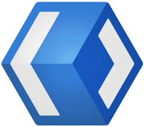

# GUI 程序
目前的主流 UI 平台大致如下：

各个平台都有自己的原生技术，但是原生技术往往难学难用，并且通用性受限，学习的性价比太低，开发的速度太慢，企业成本太高……

- windows -> C#.NET (WinUI3、WPF)
- MACOS、IOS、tvOS、watchOS -> Swift (SwiftUI)
- linux -> C (GTK+)、C++（Qt）
- Android、tv、watch -> Kotlin (Jetpack Compose)

| WinUI 3                 | SwiftUI                   | GTK +              | Compose         |
| ----------------------- | ------------------------- | ------------------ | --------------- |
|  |  |  |  |

## PC 客户端程序
时代孤儿，勉强被 JS Electron 框架保养。

桌面应用的黄金时代已经过去了。以前每个软件都想做个桌面客户端，现在大家觉得有个网页能凑合用就行。毕竟开个浏览器就能用，不用下载安装，更新也方便，开发者省心，用户也省事。

但有些场景还是需要桌面客户端——比如 VS Code、Discord、Slack 这些大家天天用的工具。它们大多基于 Electron，本质上就是个套了壳的浏览器。优点很明显：写一次代码就能跑遍 Windows、macOS、Linux；前端工程师直接上手，不用学新语言；社区组件丰富，开发速度快。缺点也同样明显：几百 MB 的体积，吃内存像喝水，启动速度慢得让人怀疑人生。

近年来 Tauri 这种轻量方案开始崛起，用系统自带的 WebView 而不是打包整个 Chromium，体积能压到 10 MB 以内。不过生态还没 Electron 成熟，想找个现成的组件可能得自己动手。对于大多数项目来说，Electron 依然是最稳妥的选择——慢点就慢点吧，好用就行。

## 移动客户端程序

Dart 语言和 Flutter 框架已经成为了移动端平台的实际霸主。

移动端的故事比桌面端复杂些。iOS 和 Android 各自为政，原生开发得写两套代码，成本直接翻倍。React Native 曾经是跨平台的首选，用 JavaScript 写 iOS 和 Android 应用，但性能和体验总觉得差点意思。

Flutter 的出现改变了这个局面。Google 自家的亲儿子，用自己的渲染引擎 Skia，不依赖系统控件，所以能保证 iOS 和 Android 上的表现完全一致。Dart 语言学起来也不难，有点像 JavaScript 和 Java 的混合体。热重载功能让开发体验极好，改完代码一秒就能看到效果，不用像原生开发那样等半天编译。

当然 Flutter 也不是完美无缺。包体积偏大，首次启动有延迟，生态不如原生成熟，有些系统功能得自己封装。但对于大多数应用来说，这些都不是致命问题。美团、闲鱼这些大厂在用，个人开发者也在用，Flutter 已经成为跨平台移动开发的事实标准。

## 游戏客户端
引擎大战之地，时局胜者 C#。

游戏开发和普通应用开发是两个世界。Unity 用 C#，Unreal 用 C++，但大多数独立游戏开发者会选择 Unity——C# 比 C++ 友好太多，学习曲线平缓，开发效率高。Unity 的生态极其丰富，Asset Store 里什么都有，物理引擎、寻路系统、UI 框架，想用就买，不想买就自己造。

游戏 GUI 框架的选择不太多。Unity 自家的 uGUI 够用但不精致，NGUI 是老牌选手但已停止维护，TextMeshPro 是文字渲染的神器。如果有更高要求，可以用 UGUI 的增强版或者第三方插件。游戏 UI 的核心是性能——60 帧的渲染压力下，任何 UI 上的开销都会直接影响游戏体验。

值得注意的是，游戏客户端通常不用跨平台框架。游戏本身就是要榨干硬件性能，多一层抽象就意味着多一层性能损耗。Unity 和 Unreal 本身就是跨平台的（它们处理了不同平台的差异），游戏开发者只需要专注于游戏逻辑和 UI 设计。

## 命令行终端客户端
该领域目前是 Rust 的专场。

命令行程序可能是 GUI 的对立面，但也是一类重要的"客户端"程序。以前这个领域是 C 和 C++ 的天下，后来 Python 崛起成为脚本语言的首选，现在 Rust 正在悄悄接管这个领域。

Rust 的优势很明显：编译后是单个可执行文件，没有运行时依赖；内存安全，不会像 C++ 那样有莫名其妙的段错误；性能接近 C++，但开发体验好太多。对于命令行工具来说，这些特性都非常重要——用户不希望在运行一个简单工具时先安装一堆依赖，也不希望工具突然崩溃丢失数据。

Rust 生态里有丰富的终端 UI 库。ratatui 是现代终端 UI 框架的前沿，支持跨平台、样式丰富、文档完善；crossterm 处理终端交互事件；tui-rust 是老牌但仍在维护的选择。用 Rust 写命令行工具已经从"小众爱好"变成了"工程实践"，很多大厂的工具链都在用 Rust 重写。

## JS 宿主环境
乘着 Web 的东风，JS 已经成为 GUI 第一顺位语言。使用一个 JS 宿主，便可以轻松实现一个跨平台的图形界面程序。最著名通用的 JS 宿主环境当属浏览器，除此之外，还有很多其他的 JS 宿主环境。

+ 小程序，微信小程序、支付宝小程序、抖音小程序……超级 App 们都有自己的小程序平台。本质上就是一个阉割版浏览器，提供了特定的 API（支付、定位、分享等），用类似 Web 技术开发应用。优点是流量入口巨大（微信十几亿用户），缺点是被平台束缚（审核、功能限制、抽成）。
+ 浏览器插件，浏览器插件让开发者能修改网页行为、添加新功能。Chrome 插件用 HTML+CSS+JavaScript 开发，能访问页面 DOM、拦截网络请求、添加右键菜单。AdBlock、Grammarly、React DevTools 这些工具都是插件。Manifest V3 是最新标准，但限制比 V2 多，开发者迁移过程痛苦。
+ VS Code 插件，VS Code 本身就是 Electron 应用，它的插件系统也用 Web 技术。插件可以用 JavaScript 或 TypeScript 编写，能扩展编辑器的功能（语法高亮、代码片段、主题、调试器）。 marketplace.visualstudio.com 上有数万插件，几乎任何编程需求都能找到现成方案。
+ 其他宿主，WPS、Adobe Creative Cloud、AutoCAD 这些桌面软件也开始提供 JS 插件 API。Office 的 Office Add-ins、Photoshop 的 UXP 插件系统，都是 JS 宿主环境的例子。传统桌面软件意识到开放的插件生态能让产品更有生命力，而 JavaScript 是最通用的选择——前端工程师多，学习成本低。
