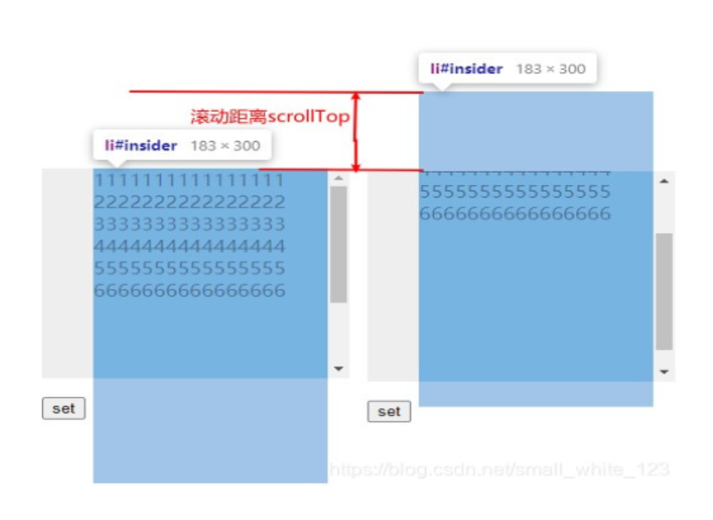

# 事件与尺寸获取

## MouseEvent
鼠标事件e触发坐标
+ ScreenX：代表相较于用户屏幕左上角的坐标，使用的是用户屏幕的逻辑分辨率
+ ClientX：代表浏览器给网页分配的视口的偏移像素，不随页面滚动而改变
+ PageX：代表相较于body元素的偏移像素，视body元素是否被滚动，可以于ClientX一致
+ layerX：代表相较于其层叠上下文父元素的偏移像素，该特性为非标准特性，但是被大多数浏览器支持
+ OffsetX：代表相较于事件监听元素的偏移像素
+ x：ClientX的简称

## 元素尺寸获取
+ ClientWidth：获取元素可视部分的大小，content+padding
+ OffsetWidth：获取元素外围大小，content+padding+border
+ ScrollWidth：获取一个有滚动条的元素，其内部可滚动内容的高度

## 元素位置获取
+ offsetLeft/offsetTop：获取元素可视部分的大小，content+padding
+ scrollLeft/scrollTop：获取一个有滚动条的元素，其内部可滚动内容已经被卷去的部分，ScrollTop的值是有范围的，介于0—scrollHeight-clientHeight，之间
