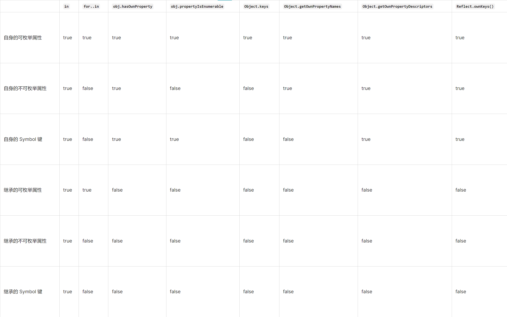
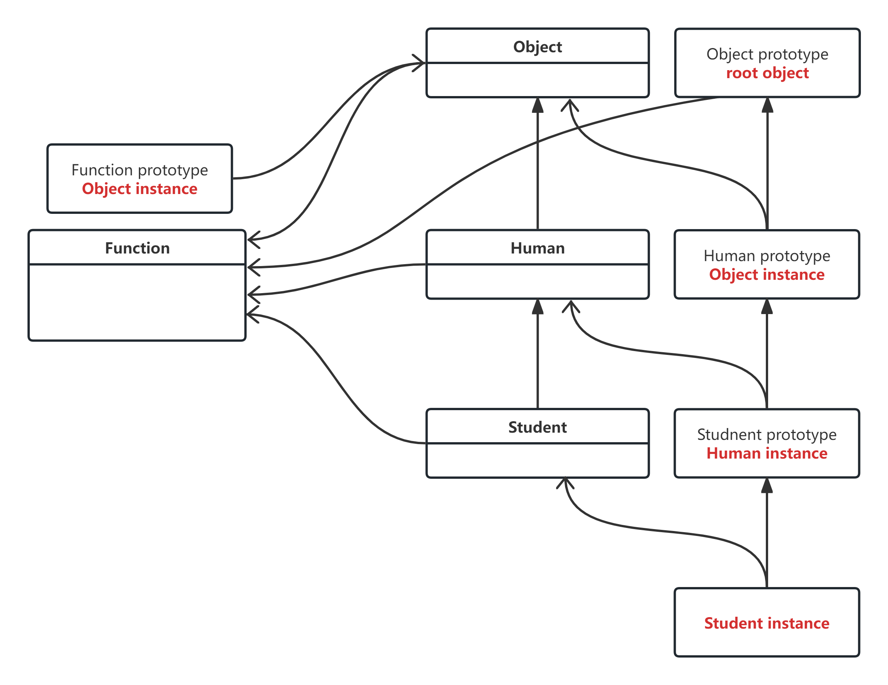
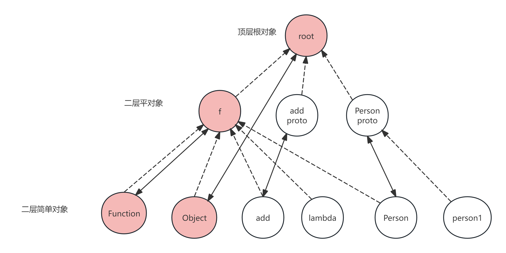

# JavaScript 基础知识

本目录包含了 JavaScript 语言的基础知识，涵盖了从数据类型到异步编程等多个重要概念。这些知识是理解和使用 JavaScript 的基础。

## 目录内容

### 1. 类型系统
- **类型转换** (`type-transform.md`)
  - 显式类型转换
  - 隐式类型转换
  - 类型转换规则
  

### 2. 对象系统
- **对象基础操作** (`obj-base-ops.md`)
  - 对象创建
  - 属性访问
  - 方法调用

- **自有属性** (`own-property.md`)
  - 属性描述符
  - 属性枚举
  - 属性配置
  

- **原型链** (`proto.md`)
  - 原型继承
  - 原型链查找
  

### 3. 类系统
- **类** (`class.md`)
  - 类定义
  - 继承
  - 静态成员
  

### 4. 异步编程
- **异步编程** (`async.md`)
  - Promise
  - async/await
  - 事件循环

### 5. 迭代器与流
- **可迭代对象** (`iterable.md`)
  - 迭代器协议
  - 生成器
  - 内置可迭代对象

- **流** (`stream.md`)
  - 流的概念
  - 流的类型
  - 流的使用
  

## 学习建议

1. 建议按照以下顺序学习：
   - 先掌握类型系统和对象系统
   - 然后学习类系统
   - 最后学习异步编程和流

2. 每个概念都配有示例代码和图表，帮助理解

3. 建议结合实践来学习，可以尝试修改示例代码来加深理解

## 注意事项

1. 这些文档主要关注 ES6+ 的特性
2. 部分内容可能需要现代浏览器支持
3. 建议使用 Node.js 环境进行实践