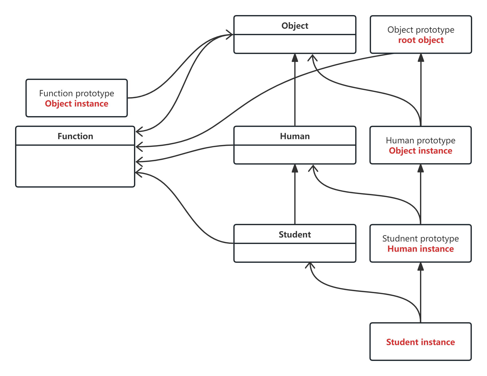
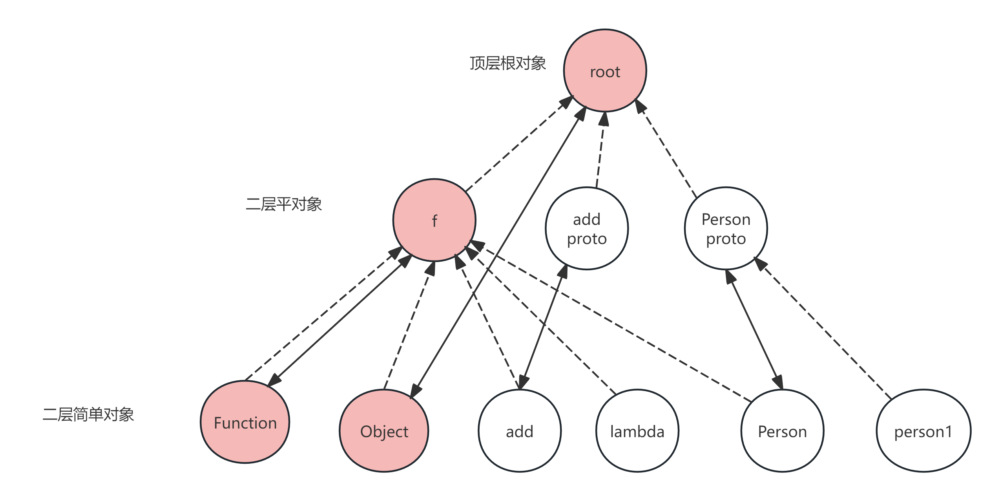

# 原型链

## 原型链是什么

原型链是JavaScript中的一种机制，它允许对象继承属性和方法。每个JavaScript对象都有一个原型对象，这个原型对象也有自己的原型对象，以此类推，形成一个链条。当访问一个对象的属性或方法时，如果该对象本身没有该属性或方法，JavaScript引擎会沿着原型链向上查找，直到找到为止。

## 原型链的作用

原型链的作用是实现对象的继承。通过原型链，子对象可以继承父对象的属性和方法，从而实现代码的复用和模块化。

## 原型链的原理

