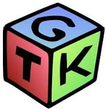
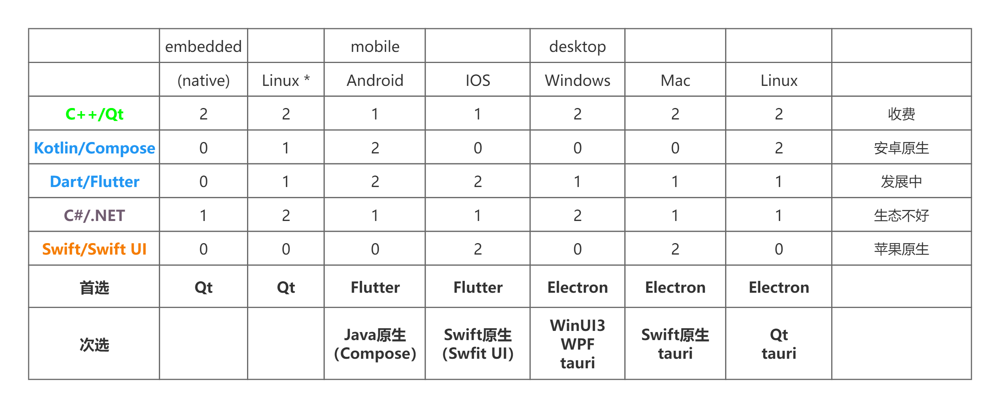
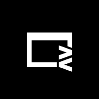

# UI 框架
JS 拥有以 Web 平台为运行时的丰富的 UI 框架生态，能够快速构建跨平台的图形界面程序。

目前的主流 UI 平台大致如下：

各个平台都有自己的原生技术，但是原生技术往往难学难用，并且通用性受限，学习的性价比太低，开发的速度太慢，企业成本太高……

- windows -> C#.NET (WinUI3、WPF)
- MACOS、IOS、tvOS、watchOS -> Swift (SwiftUI)
- linux -> C (GTK+)、C++（Qt）
- Android、tv、watch -> Kotlin (Jetpack Compose)

| WinUI 3                 | SwiftUI                   | GTK +              | Compose         |
| ----------------------- | ------------------------- | ------------------ | --------------- |
|  |  |  |  |

对于特殊平台，如 Web 平台，使用 Web 开发技术；嵌入式平台，使用 C++的 Qt 框架。抛开嵌入场景不谈，如果希望编写一次代码从而实现到处运行，在以前的一定时期内都是不可能的，而目前随着 Web 技术的功能和性能日益强大，且得益于 Web 技术本身与操作系统无关的特性，反而在社区中慢慢形成一种使用浏览器套壳的应用的风气，这种应用的性能天生就不好，需要臃肿的运行时环境、运行速度和效率不高、软件功能和权限受到平台局限……我们不好评价这种做法，但是这确实是开发者的无奈妥协。
目前，Web 应用是唯一能够在保持开发速度、一致性和差异性处理上满足横跨 PC、移动端的 GUI 方案。其他的方案目前或多或少存在着问题。

## 跨平台 UI 框架

- Qt。主要在嵌入式和高性能软件领域等高端领域，碍于 C++本身的难度和开发效率问题，在很多时候，项目进行选型的时候，开发人员和项目管理者往往本着能不用 C++就不用 C++的宗旨；另外，C++的开发环境基础设施与其他语言相比，堪称稀烂，开发体验较差；
- Electron。包揽了大部分的中低端领域 PC 端 GUI 开发市场，开发速度快、界面美观、招人容易、跨平台一致性好、差异性也好，但是作为 Web 技术架构的 GUI 技术，其缺点自然是继承了 Web GUI 应用的几乎所有缺点；

二者主要适用于 PC 端，对于移动端的支持不太行，移动端主要选手还是 Flutter。

**未来可期**

- Flutter。Flutter 是目前最未来可期的技术，重写的底层引擎 Impeller，旨在解决 Flutter 应用的“Early-onset jank”问题，同时为 Flutter 应用提供更高的定制性和性能。通过自绘制引擎，Flutter 完成了全平台跨端的能力。但是，没有选择 JavaScript 而使用 Dart 语言是 Flutter 的痛点，Dart 语言注定会阻止一部分先入为主的人。
- tauri。tauri 可以看做是为 rust 程序员使用的 GUI 框架，前端人基本可以不看。不过它本身的优势确实也是非常明显的，其包体积很小，利用操作系统的原生浏览器内核，同时使用 rust 做后端，也能在后端的方面提供非常强悍的性能，将耗时任务交给 rust，可以在一定程度上解决 Electron 的 js 速度慢的问题。不过，tauri 带来了新的问题，就是又把 Electron 抹平的 Web 兼容性问题带回来了。这样，书写 tauri 既要很高的 Web 前端水平，又要学习 rust，那么这样的框架自身也是很劝退的。tauri 对于移动端的适配是板上钉钉的，它可以带来 Electron 不想干的功能。随着 rust 在前端领域的渗透，如果 rust 能招致越来越多的前端人去学习，那么届时，tauri 也将成为一个新的领军框架。

| Qt              | Electron                    | Flutter                   | Tauri                 |
| --------------- | --------------------------- | ------------------------- | --------------------- |
|  |  |  |  |

综上，目前的可供选择的 GUI 框架的情况大致如下

补充一些 web 套壳技术。

- capacitor，移动端 web 套壳技术。这是一个移动端的 web 容器，相当于移动端的 Electron，使用 web 技术进行移动端开发，同时提供丰富的插件，可以调用移动端的功能。
- neutralino，桌面端 web 套壳技术。桌面端超轻量 web 套壳，用于满足非常小的桌面应用需求。
- webview，C库，用于在桌面端嵌入 web 技术，可以用于开发桌面端应用，但是其功能非常有限，只能用于嵌入 web 技术，不能提供丰富的插件，也不能调用桌面端的功能。

| Capacitor               | Neutralino                 | Webview                 |
| ----------------------- | -------------------------- | ----------------------- |
|  |  |  |

## Web 框架

目前的 Web 框架主要是 React 和 Vue，呈现出一大一中群小的局面，React 占据了生态中的大部分，Vue 其次，其他的框架占据的份额很小。

- React。一大
- Vue。一中。
- Angular。使用面向对象、依赖注入、装饰器等技术进行开发，大而全。在 React hooks 横空出世后，人们逐渐发现了 Web 前端 UI 开发时灵活性的重要性，而面向对象的传统思路，加上在 js 中`this`是个毒瘤，面向对象的编程风格逐步被函数编程风格所侵蚀，而使用面向对象的编程风格的 Angular 就显得自由度太低，灵活性差，开发速度慢，框架笨重，性能也不行，份额持续减少，社区中也出现了很多劝退的声音。Angular 的出路在于做减法，不断地减少框架自身的冗余设计，降低开发者的心智负担，提供更加自由、灵活、方便的开发体验。而在后续的版本更新中，Angular 引入了关键的 Signal 机制，提高了开发效率的同时，大幅提升了性能。
- Svelte。2016 年首发，2019 年稳定的新兴框架，提出了无虚拟 dom 的架构，不生成运行时，使用和 vue 相似的单文件编译方式，拥有强悍的性能，较小的内存占用和较小的打包体积。但是，随着项目规模的不断扩大，其打包体积会越来越膨胀，最终丧失在打包体积方面的优势，反而变成劣势。
- Solid。2018 年首发，2020 年稳定的新兴框架，究极框架缝合怪，是一个非常年轻的框架，汲取市面上很多前端框架之长。Solid 在语法上使用了 React 的 jsx 语法，在架构上使用了 Svelte 的无虚拟 dom 的原生操作，在响应式方面参考了 konckout.js，同时能够集成 mobx 和 vue 的响应式系统……前端框架性能之王，同时兼顾速度、内存、打包体积的全能选手。唯一的缺点就是，用的人太少，生态不行。

| react                 | vue               | angular                   | svelte                  | solid                 |
| --------------------- | ----------------- | ------------------------- | ----------------------- | --------------------- |
|  |  |  |  |  |

### 其他框架

- lit。面向 Web Component 的前端框架，使用原生 Web Component 来进行组件化的框架。
- Astro。提出了“孤岛架构”，拥有优秀的页面加载性能
- Vitepress。
- Docusaurus。

