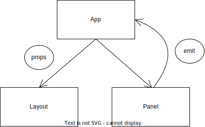

# Vue

## 组件通信
ViewModel在View层内进行流动的时候，遵循函数调用的规律，根据函数的纯洁性可以进行分类。数据从根部通过属性或者provide传递向叶子的时候，数据应当尽量保持单向传递，如果是基本类型数据的话，那么无话可说，直接传入，数据只能在父组件中改变，并且只能props再传入。“再传入”指的是，子组件是否需要使用额外操作来监听父组件传入的props的变化从而再次初始化组件的数据和初始状态，由于vue的组件顶层逻辑只执行一次，所以，props变化时，需要使用额外的监听操作来处理子组件中的数据。如果引用类型或者说对象，由于其数据结构的复杂性，需要分为几种解决方案的级别：
+ 脏函数方案。
数据由父组件创建后，传入子组件，子组件可以对复杂数据的内部进行直接修改。
特点：实现和操作简单，但是props不可再传入，性能较高，可复用性较差。
使用建议：该对象最好只由父组件和一个子组件所共同持有，不要在多个组件中持有，这样可以减少数据的不确定性，同时，甚至可以移交所有权，父组件将数据的所有权移交给子组件，父组件不得修改，但是可以读取。
+ local store方案。
由子组件定义一个local store类型，所有调用子组件的父组件应当实例化一个local store对象，并传入其子组件中，对于数据的修改应当由local store提供，父组件和子组件均可调用。
特点：该方案可以形成一个局部的store，使得store在多个组件中进行分享，使用方便灵活，性能较高，可复用性中等，其可复用性依赖于该local store。props不可再传入。
使用建议：可以结合EventBus，让store继承EventBus，从而直接通过store进行数据的订阅而无需使用组件事件。
+ 纯函数方案。
数据由父组件创建，并规定修改的方法，父组件传入子组件后，子组件不得再修改，子组件通过定义事件，描述数据可能发生的变化，由父组件监听事件然后更新数据。
特点：该方法满足单向数据流，提供规范的组件交互，props可再传入，但是操作繁琐，性能较差，可复用性较高。
使用建议：推荐在子组件中通过递归声明对象的代理来进行emit，这样可以让代理对象来自动emit，并且使用手感可以像脏组件一样，比较直接方便，但是如此props不可再传入。另外，如果父组件不处理事件，那么数据也将无法更新。

总结：引用类型的props统一不要再传入。根据不同的情况酌情选取方案。
备注：数据派生，computed/computedObject或者ref+watch，

