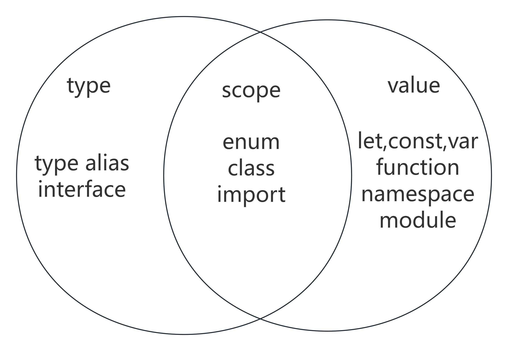

# Typescript

一个type的名字代表一个在typescript编译时期存在的编译器使用的值，在运行的时候是不存在的。

一个value的名字代表一个在运行时也能访问的变量。

一个scope的名字代表一个type同时还是一个value

一个function的名字只代表一个value，但是在声明一个function的同时，会产生一个 `<typeof FuncName>` 的type

