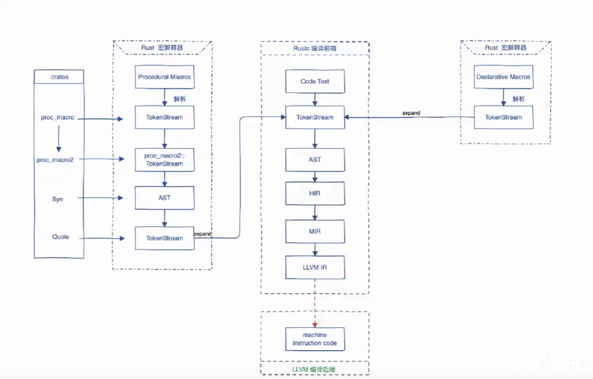

# 宏
宏是指生成代码的代码，它们的工作原理是：编译器会将传入宏的代码块作为输入，经过宏处理后生成新的代码。和 C 语言的宏相比较起来，rust 的宏有更多的规则限制，更加现代，不像 C 语言那样纯粹地基于字符串进行替换。

> C 语言的宏是一个简陋的系统，基于纯粹的字符串替换，在 C 的预处理器进行预处理的期间被展开。C 宏使用起来可以非常地自由放纵，这将使得宏展开的过程难以控制，给代码带来非常大的不确定性。另外，展开的宏和内联函数等特性，会导致代码调试的时候，调试器无法找到目标函数和代码，导致定位困难。但是，碍于 C 语言的语言特性太弱，宏又是 C 语言项目中不可缺失的一部分，这就要求 C 语言开发者必须明确自己的宏在做什么，保持良好的编码规范，要求项目管理者对项目进行严格管理和明确约束。


## 属性标记
rust 中使用 `#[]` 来对一个目标进行编译时的元数据定义，从而影响编译器的行为，它可以被放在结构体、枚举、函数、模块等目标的声明处。它相当于其他语言中的装饰器。


## 宏分类
宏主要分为两个大类，声明式和过程式宏。

声明式宏在编译时期被**声明式宏解释器**以模式匹配的方式进行展开，工作机制类似于正则表达式，通过正则表达式匹配源代码，然后根据匹配的模式映射成另外一段代码，这段代码往往是基于源代码的增强。

过程式宏需要我们编写一个独立 lib crate，先把这个 lib 编译通过之后，然后再在我们希望使用的项目中导入这个库进行使用。过程式宏其实是一个个由 rust 语言编写的纯函数，这些函数的签名是固定的，他接受源代码经过编译器进行词法分析后生成的 Token 产物，然后对 Token 流进行加工，返回新的 Token 流，从而替换原本的代码，启动增强和修改源代码的作用。


| 宏类型           | 定义方式                  | 使用位置                                   | 示例               |
| ---------------- | ------------------------- | ------------------------------------------ | ------------------ |
| 声明式宏         | `macro_rules!`            | 任何代码位置（如函数内、模块内、全局）     | `println!`、`vec!` |
| 过程式宏->派生宏 | `#[proc_macro_derive]`    | 结构体、枚举定义上，结合 derive 宏一起使用 | `#[derive(Debug)]` |
| 过程式宏->属性宏 | `#[proc_macro_attribute]` | 项（如模块体、函数、结构体）定义上         | `#[test]`          |
| 过程宏宏->函数宏 | `#[proc_macro]`           | 类似函数调用位置                           | `my_macro!()`      |




## 声明宏
声明宏使用的时候就像一个**函数**一样进行调用，通过模式匹配的方式生成代码，使用 `macro_rules!` 宏来定义。在调用的时候，可以使用三种括号来进行调用 `()`、`[]`、`{}`，但是要注意，括号也在匹配的内容之内。
```rust
macro_rules! say_hello {
    () => {
        println!("Hello, world!");
    };
}

fn main() {
    say_hello!();  // 输出: Hello, world!
}
```

## 过程宏
过程宏是通过解析 Rust 代码并生成新的代码来工作的，它在使用的时候拥有多种表现形式，它在定义的时候通过编写一个合法的 rust 函数来解析输入的 rust 代码，从而生成更多的代码，同时需要结合**元宏** `proc_macro_xxx` 来定义。

+ 属性宏
  一个派生宏是指能够放在 `#[derive(MyDeriveMacro)]` 这个高阶宏 derive 中的宏。派生宏通常用于为结构体或枚举自动实现 trait。使用 `proc_macro_derive` 进行定义。属性宏允许我们为各种元素（如结构体、函数等）添加自定义行为。这类宏通常用于注解代码，提供额外的功能。
  ```rust
  // lib.rs
  use proc_macro::TokenStream;

  #[proc_macro_attribute]
  pub fn my_attribute(_attr: TokenStream, item: TokenStream) -> TokenStream {
    // 修改 item 或返回新代码
    item
  }
  ```
+ 派生宏
  一个派生宏是指能够放在 `#[derive(MyDeriveMacro)]` 这个高阶宏 derive 中的宏，该宏需要以独立 crate 的方式进行定义。派生宏通常用于为结构体或枚举自动实现 trait。使用 `proc_macro_derive` 进行定义。派生宏可以看作是属性宏的子类型，它更加专注于为一个已有的 struct 进行修饰，被语言所原生支持。**派生宏无法修改原有的代码，其输出会被追加到原有的结构体下方，而不是替换原有的结构体**。
  ```rust
  extern crate proc_macro;
  use proc_macro::TokenStream;

  #[proc_macro_derive(MyDebug)]
  pub fn my_debug(input: TokenStream) -> TokenStream {
      let input = syn::parse_macro_input!(input as syn::DeriveInput);

      // 我们为结构体生成一个简单的 Debug 实现
      let name = &input.ident;
      let gen = quote::quote! {
          impl std::fmt::Debug for #name {
              fn fmt(&self, f: &mut std::fmt::Formatter) -> std::fmt::Result {
                  write!(f, "{} {{}}", stringify!(#name))
              }
          }
      };

      gen.into()
  }
  ```
+ 函数宏
  一个函数宏是指能够像函数一样调用的过程宏，使用 `proc_macro` 进行定义。但是注意，宏在调用的时候其实可以使用三种括号来 `()`、`[]`、`{}` 来进行调用，而不只是圆括号。函数式可以看作是升级版的声明宏，只是声明宏是通过简单的正则匹配，而函数宏可以操作代码的语法树。
  ```rust
  // lib.rs
  use proc_macro::TokenStream;

  #[proc_macro]
  pub fn my_func(_attr: TokenStream, item: TokenStream) -> TokenStream {
    // 修改 item 或返回新代码
    item
  }
  ```

## 过程宏开发
过程宏需要单独定义成一个 lib crate 进行编译。

```rust
pub fn my_macro(attr: TokenStream, item: TokenStream) -> TokenStream {
  // ...
}
```

```rust
#[my_macro(hello)]
fn demo() {

}
```

在宏运行时，attr 代表的内容是属性标记中的**宏调用的圆括号中的内容**，item 代表的是**被修饰对象的内容**。解析的时候不会进行 rust 语法的分析，只是进行词法解析。

词法解析的内容就是根据字符串中的符号的类型对字符串的内容进行结构化表达。

从 TokenStream 向 ST（Syntax Tree）进行转换，这是一个按照 rust 语法进行基本解析的过程，比起只进行词法解析更加进了一步，
