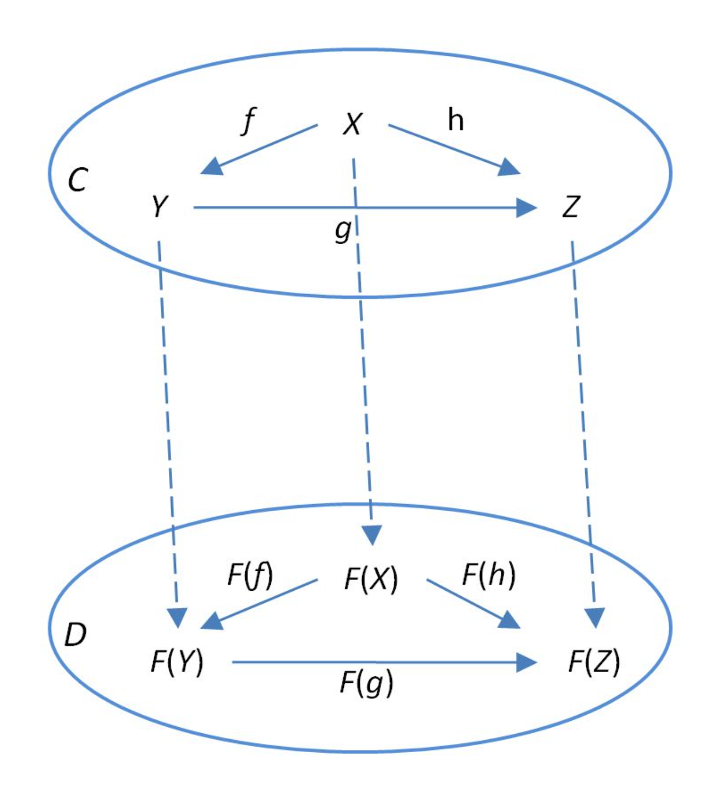
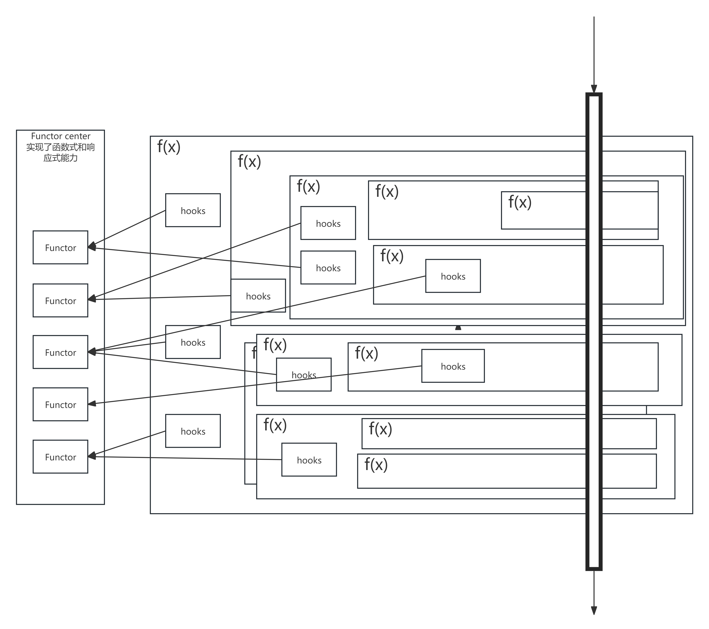

# 函数式编程

函数式编程是一种编程范式，它将程序视为数学函数对输入数据的评估从而产生输出的过程。并强调使用纯函数、不可变数据、高阶函数和函数组合等概念。

## 函数式编程的四个概念
函数式的世界中，有四个基本概念：常量、纯函数、变量、脏函数。要区分这四个概念，需要先理解生命周期和作用域。

生命周期：一个对象或者数据从创建到死亡的全过程。创建 -> 更新* n -> 销毁，（6 个 hook）。常量只会经历创建和销毁，而变量会经历更新。
作用域：全局作用域和局部作用域，全局作用域对程序的所有部分可见，局部作用域对某个部分的程序和代码可见。全局作用域的生命周期与常量类似，局部作用域的生命周期与变量类似。
副作用：一个函数在运行的时候，与外界发生了交互，对外界产生了影响。

> 函数式要求，对变量做出限制：
> 1. 尽量多地使用常量，而不是变量；
> 2. 不要使用全局变量，只有常量才能全局；
> 3. 函数应当是纯的；




+ 常量

常量是指一经创建就不再改变值的量，常量具有**可确定性**，常量是可复用的，常量是可组合的，所以往往可以被放置在全局作用域中，拥有广泛的可见性和较长的生命周期。

+ 纯函数
纯函数是指接受一些输入，并在进行一些计算处理后，返回一定的输出的这一程序过程。相较于普通的函数，纯函数的输入和输出是一一对应的，纯函数的输出只依赖于输入，纯函数的输出不会受到外部状态的影响。纯函数是函数式编程的核心，具有纯洁性、可复用性、可组合性、可测试性、较高的可维护性，因此它往往可以被放置在全局作用域中，拥有广泛的可见性和较长的生命周期。

纯函数的优势：
+ 可确定性：具有可控的行为和确定的输入输出；这使得程序员可以轻松地理解和预测纯函数的行为，便于使用和维护；
+ 可测试性：不依赖于外界环境，可以方便地测试；而脏函数，在测试前需要对环境进行初始化，测试后需要对环境进行清理，增加了测试的复杂度；
+ 可移植性和可复用性：不依赖外界环境，可以轻松移植到不同的平台，这里说的外界环境，包括全局变量、IO操作、网络请求等常见的程序操作；同时，由于依赖少，可以轻松地被复用，减少了代码的重复性；
+ 可重入性和可并行性：不会改变外部状态，可以随意并行，简化了**多线程编程**的难度；同时，可重入性，带来了**响应式编程**的便利性，因为要无痛响应，保持函数行为的可控是一个重要前提；
+ 可缓存性：可以轻松进行缓存，主要用于耗时任务，加快程序的速度；


+ 变量
变量是相对于常量而言的。变量拥有**不确定性**，变量拥有 update 生命周期。在函数式编程中，变量也被称为状态。在大型的应用程序中，程序的复杂性往往因为变量的不可控而大大增加。

一方面，当我们需要进行某一个操作时，需要校验一些变量的合法性，当一个程序依赖多个变量的时候，校验的复杂就会飙升，而如果当多个程序模块共享一些变量的时候，在每一个模块当中都需要重复进行校验。另一方面，如果变量之间存在依赖关系，那么，当一个或多个变量发生变化时，同步依赖于它的变量是一个复杂而繁琐的问题，同时可能会引入**多线程编程**的**资源竞争**问题。因此，应当让变量的生命周期尽量减短，限制其作用域，从而降低程序复杂度，保证程序的可维护性。对于第二个方面，可以使用**响应式编程**来解决。

+ 脏函数
脏函数是相对于纯函数而言的。如果一个函数与外界发生了交互，造成了一些意想不到的影响，那么这个函数就是一个脏函数，也可以被称为**副作用**。一个函数可能因为以下途径产生副作用：
1. 函数直接依赖或引用了**外部作用域中的变量**，从而形成了隐式参数；\$r、\$w
2. 函数通过传入的指针修改了指针指向的数据，从而对其参数进行了修改；\$m
3. 函数执行了 IO 操作，如读写文件、网络请求等，其本质是修改外界数据的状态；\$i、\$o
4. 调用了其他脏函数（脏函数的传染性）；

> ### JS 中的隐性副作用
> 除去一些常见的副作用，JS 中有一些隐性副作用可能会被忽略，如：
> 1. `async/await` 和 Promise 的使用；
> 2. `setTimeout`、`setInterval` 的使用；
> 3. `Math.random()` 和 `Date.now()` 的使用；
> 4. `console.log()` 的使用；
> 5. 多数 Web API 的使用；
> 6. ......

总结下来：主要由三种脏函数：1、隐参函数；2、写参函数；3、IO 函数。

## 纯函数和函数组合
**函数组合**是指将多个函数组合成一个函数，从而获得更复杂的功能。语言支持**高阶函数**是实现组合的前提。函数组合是函数式编程中的核心概念，组合可以对多个函数进行创建、增强、pipe、柯里化等，将多个简单的函数组合成一个更大的函数，从而实现更复杂的逻辑。

组合往往是针对于纯函数而言的，对于脏函数而言，组合的意义被大大削减，因为脏函数的副作用会限制其通用性。

> 函数组合的概念区分于面向对象中的组合。面向对象中的组合是指一个类实现了多个原子化的接口，从而组合了多种**能力**，以达到程序的复用性。同时，解决了多继承的菱形继承问题和普通继承的代码粒度问题。

### 高阶函数
高阶函数是指至少满足以下条件之一的函数：
1. 接受一个或多个函数作为参数；
2. 返回一个函数；

高阶函数是一种强大的语言特性，在支持高阶函数的语言中，它允许我们以函数作为一等公民，从而实现函数的抽象、复用、组合等操作。高阶函数是函数式编程的核心概念，它使得函数式编程具有更高的抽象层次和更强的表达能力。

### 多元函数
函数根据参数的个数可以分成一元函数、高阶一元函数、二元函数、高阶二元函数、中阶二元函数等等。对于一元函数，我们可以简单地将一个参数的结果传入另一个函数中，这样依次调用，从而形成一个像流水线一样的结构，让程序的逻辑变得有条理。二元函数可以通过面向对象的代码来简化书写。组合或者 pipe 的写法由链式调用和使用高阶多元函数 compose 或者 pipeline 来完成，compose 从右往左调用，pipeline 从左往右调用。

## 变量和状态管理
对于变量而言，我们无法避免其副作用，但是我们可以通过一些手段来减少副作用的影响范围，从而降低程序复杂度，保证程序的可维护性。状态管理就是致力于解决这个问题。

### 状态容器
为了隔离状态的影响范围和封装对于状态的操作，往往将状态封装到一个容器中，这个容器定义了对一类状态 T 的一种操作或者一系列操作，此处的操作可以是一个一元函数或者二元函数，可纯可脏。为了提高操作定义的复用性和控制粒度，容器分为不同的类型，每种容器只定义一种操作，往往是原子化的。状态容器可以参考面向对象编程中的对象。

## 脏函数和副作用
在程序设计中，我们无法完全避免副作用，但是我们可以通过一些手段来减少副作用的影响范围，从而降低程序复杂度，保证程序的可维护性。一般地，一个程序的入口函数 main 就是一个脏函数，它接受一些输入，然后调用一些函数，最后输出一些结果。一个程序最纯的结果，就是除了 main 函数是脏函数，其他函数都是纯函数。

### 脏函数的延迟执行
脏函数在不被调用之前都可以认为是无害的，但是直到它被调用之后，那么副作用产生，对于函数式的编程而言，不是要完全没有副作用，而是要把副作用局限在一个很小的范围内，或者将副作用的发生延迟到尽可能后期，最迟是在用户输入数据（前端）或者对外界进行访问（后端）的时候，这个时候发生的副作用是无可避免的。我们可以采用**惰性求值**和**声明式副作用**来延迟副作用的发生。

```js
// Dirty
function readFile(path) {
  return fs.readFileSync(path, 'utf-8');
}

// Pure
function readFile(path) {
  return (env) => {
    fs.readFileSync(path, env.encoding);
  }
}

// ReadAction
// 将 read 这个 IO 动作抽象为一个数据结构或者可以说是配置，使用纯函数定义配置
function ReadAction(path) {
  return {
    path: path,
    encoding : 'utf-8',
  }
}

// 使用接受某种配置，然后执行一个 IO 操作的执行器
function executeAction(action) {
  return fs.readFileSync(action.path, action.encoding);
}
```

### 脏函数的可原谅性
在实际的开发中，我们无法完全避免副作用，但是我们可以选择原谅一些副作用，从而获得更高的开发自由度，如：
1. **私有闭包**，一个**闭包函数**独享了一个外部变量，这个外部变量除了这个函数，其他函数都不能访问。可以认为这个外部变量是函数私有的，这个副作用是可原谅的；典型例子：随机数生成器、节流函数、单例函数、函数缓存；在 JS 中，由于是单线程的，所以私有闭包不需要考虑并发问题；
2. **局部变量**，如果一个函数在内部创建了一个变量，即拥有一个变量的**创造权**，可以认为这是在**初始化**阶段，那么在函数的内部修改该变量或者调用**写参函数**修改它，不会被传染；
3. **独立 IO**，在函数中，调用了一些独立性较强的 IO 模块，这些模块对程序的主体功能没有直接影响，并且不会抛出错误，如日志打印、调试信息等，这些方法往往独立于程序的主体逻辑，不容易增加程序的逻辑复杂度，这些副作用是可原谅的；

## 其他概念
+ 高阶函数：以函数为参数或返回值的函数
+ 一元函数：只有一个参数和一个返回值的函数叫做一元函数
+ 纯函数：运行之后不产生副作用的函数，它具有与传入的参数一一对应的可预期的返回值，甚至更纯——不依赖于外界的变量。
+ 柯里化：将一个多元函数转化为一个返回可连续调用的一元函数
+ 组合：将多个函数转化为一个组合功能的函数。compose/pipeline，compose将函数从右至左调用，pipeline从左至右调用
+ Point-Free：函数组合。使用各个小功能的函数组合形成更大更复杂的一个函数，直到需要输入之前，我们不关心具体需要处理的数据。
+ 声明式：尽量只声明变量，而不是去修改已有的数据
+ 不可变：数据一但被创建就不应被改变，并且如果是一个复杂类型，那么其内部的属性也应该是不可变的。
