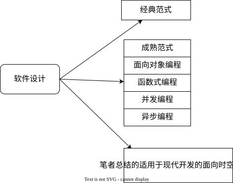

# 软件设计
软件设计的基础意义是根据实际的业务需求编写软件进行实现。但是，在实际的环境中，事情往往没有想象中的那么简单，我们需要额外面临更多考验。例如：可行性问题、成本问题、可维护问题、质量问题等。如何解决这些附加问题是研究软件设计的根本动力。

## 理论概览
在众多的[经典范式](./typical/)理论中，我们感到了百家争鸣般的喧闹。有的是宏观理论，为我们提供方向性指导，有的是专精细分领域，为不同的领域提出可实践的意见。

成熟大派，更是在特殊的领域内独占山头，为开发者提供一个稳定的栖息之地：
+ [面向对象编程](./oop/)
+ [函数式编程](./fp/)
+ [并发编程](./concurrent/)
+ [异步编程](./async/)

笔者总结[面向时空](./spacetime/)是为了破除这些理论的隔阂，从一个更高更全面的维度去理解这些理论的本质，总结概括杂乱的理论商品，减少选择困难。并走到实践中去，提出具体的实践方案，让理论变得可行。

对于任意一个 IT 行业的技术，我们在学习它的时候，可以从使用者和实现者两个层面去学习，如果我们只是简单使用，那么可以从使用者的角度上去学习，如果我们需要自定义它，那么我们需要从实现者的角度上去学习。以此角度，一个人对于一个技术的掌握程度可以分为
+ 使用：作为技术的使用者，掌握基础的使用方法
+ 调优：作为技术的深度使用者，初步理解了其外观结构，能够根据实际业务进行调优
+ 设计：作为技术的设计者，整体掌握了技术的架构
+ 实现：作为技术的实现者，整体掌握技术架构，并且熟悉技术实现中的特定细节

某个技术点，如果市面上存在着多个同类型的技术或者解决方案，那么作为其使用者，考虑**如何选型**是最基础的考量。

> 一些运行在用户态的软件承担着较为底层的基础工作，并且需要具有极高的运行性能，是软件设计的标杆。编写这些软件需要深刻理解领域内的专业知识和良好的工程设计，学习它们有助于提高个人的软件设计能力，例如：
> + 模拟器，用于模拟和虚拟化硬件平台，从而在一个操作系统上运行另一个独立的操作系统。QEMU、VirtualBox、VMWare...
> + 编译器/运行时，用于将一个语言的源码文件编译成另一种语言并可以在不同的平台上进行执行，GCC、MSVC、汇编器、V8、JVM...
> + 浏览器，用于实现 Web 标准和渲染 Web 程序，Chrome、FireFox、Safari...
> + 数据库，用于高效管理磁盘数据，实现 sql 标准，并对外提供数据服务，提供数据并发处理和事务功能，MySQL、Redis...
> + 游戏引擎，用于提供高效的游戏渲染解决方案和一站式游戏开发能力，Unity、Unreal、Godot...
> + AI 基架，用于训练和驱动 AI 模型，封装各个 GPU 平台的通用计算接口，Pytorch...
> + 以太坊节点，用于计算区块，通过共识机制支持链上应用正常有序工作，Go Ethereum...
> + 转译器，用于在 linux 系统上，运行 windows 程序，例如 wine/proton