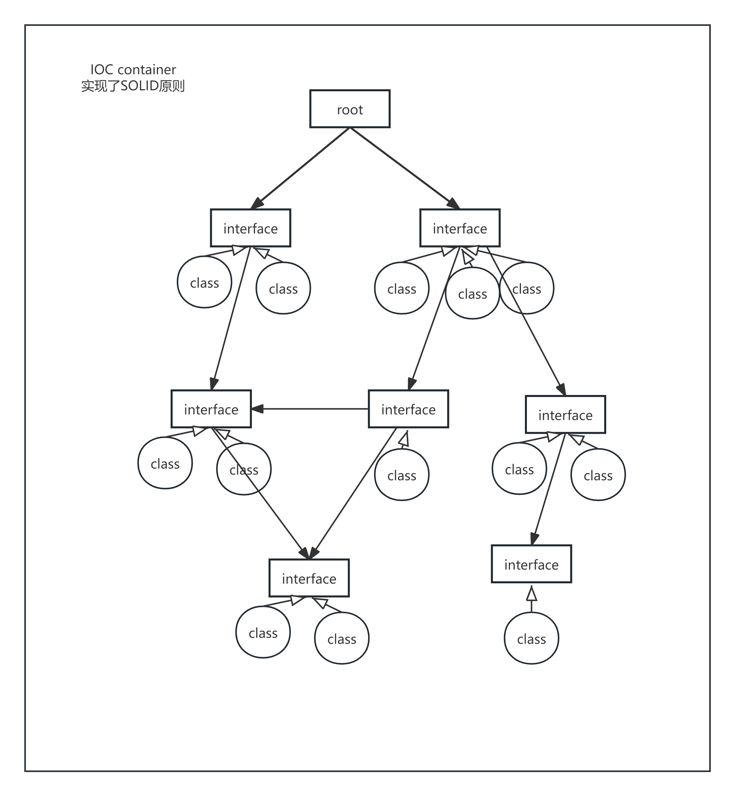

# IOC (Java篇)

控制反转是一种设计原则，用于将对象的创建和依赖关系的管理从应用程序代码中分离出来，从而提高代码的可维护性和可测试性。

在传统的面向对象编程中，对象的创建和依赖关系的管理通常由应用程序代码直接负责。例如，一个类可能需要另一个类的实例作为其依赖项，应用程序代码需要负责创建和配置这些依赖项。这种直接依赖关系可能会导致代码难以测试和维护，因为应用程序代码需要了解和依赖其他类的实现细节。控制反转可以用于将对象的创建和依赖关系的管理从应用程序代码中分离出来，应用程序代码不再直接创建和配置依赖项，而是通过依赖注入（Dependency Injection）的方式将依赖项注入到应用程序代码中。依赖注入可以通过构造函数注入、属性注入或方法注入等方式实现。



## 控制反转的优点

- 降低耦合度：通过将对象的创建和依赖关系的管理从应用程序代码中分离出来，可以降低应用程序代码与其他类的耦合度，从而提高代码的可维护性和可扩展性。
- 提高代码的可测试性：通过依赖注入，可以将依赖项替换为模拟对象或测试替身，从而更容易编写单元测试和集成测试。
- 提高代码的可重用性：通过将对象的创建和依赖关系的管理从应用程序代码中分离出来，可以更容易地重用和共享代码。
- 实现开闭原则：在后续的维护当中，如果需要修改依赖项的实现，只需要修改依赖项的实现，而不需要修改应用程序代码，从而实现开闭原则。

## 控制反转的缺点

- 增加了复杂性：通过依赖注入，需要引入额外的依赖注入容器或框架，这可能会增加系统的复杂性。
- 学习成本：对于新手来说，理解和使用依赖注入可能需要一定的学习成本。
- 性能开销：依赖注入容器或框架可能会引入一定的性能开销，特别是在频繁创建和销毁对象的情况下。

## 控制反转的示例

```java
public class UserService {
    private UserRepository userRepository;

    public UserService(UserRepository userRepository) {
        this.userRepository = userRepository;
    }

    public void createUser(User user) {
        userRepository.save(user);
    }
}

public class UserRepository {
    public void save(User user) {
        // 保存用户到数据库
    }
}

public class Main {
    public static void main(String[] args) {
        UserRepository userRepository = new UserRepository();
        UserService userService = new UserService(userRepository);
        userService.createUser(new User());
    }
}
```

## Spring

Spring 是一个流行的 Java 框架，它提供了强大的依赖注入功能，可以简化应用程序的开发和维护。Spring 的依赖注入可以通过 XML 配置、注解配置或 Java 配置来实现。

Spring 有多个模块，包括

- Spring Core：提供了核心功能，包括依赖注入、事件处理、资源管理等。
- Spring AOP：提供了面向切面编程（AOP）功能，可以用于实现横切关注点，如事务管理、日志记录等。
- Spring MVC：提供了模型-视图-控制器（MVC）架构的支持，可以用于构建 Web 应用程序。
- Spring Context：提供了应用程序上下文，包括 Bean 工厂、事件发布、国际化等。
- Spring Data：提供了数据访问对象（DAO、ORM）支持，可以简化数据库访问。
- ......

## Spring Bean

Spring Bean 是 Spring 框架中的一个核心概念，它是一个由 Spring 容器管理的对象。Spring 容器负责创建、配置和管理 Bean 的生命周期。

Spring Bean 的生命周期包括以下步骤：

1. 实例化：Spring 容器通过反射机制创建 Bean 的实例。
2. 属性注入：Spring 容器将 Bean 的依赖项注入到 Bean 中。
3. 初始化：Spring 容器调用 Bean 的初始化方法，通常是通过实现 InitializingBean 接口或使用 @PostConstruct 注解。
4. 使用：应用程序代码可以使用 Bean。
5. 销毁：当应用程序上下文关闭时，Spring 容器调用 Bean 的销毁方法，通常是通过实现 DisposableBean 接口或使用 @PreDestroy 注解。


## Spring 依赖注入
bean 实例化方法
- 构造函数（直接与类名绑定的方式）
- 工厂函数（定义一个工厂类，并指定工厂方法）
- 工厂接口（实现 spring 提供的工厂接口和工厂方法）
- 动态注册（使用容器的动态注册的函数，添加已经实例化的对象）

bean 在使用时依赖注入可以通过
- 构造函数注入
- 属性注入
- 方法注入等

bean 的作用域
- 单例（Singleton）：Spring 容器中只有一个 Bean 实例，默认的作用域。
- 原型（Prototype）：每次请求时，Spring 容器都会创建一个新的 Bean 实例。
- 请求（Request）：每次 HTTP 请求时，Spring 容器都会创建一个新的 Bean 实例。
- 会话（Session）：每次 HTTP 会话时，Spring 容器都会创建一个新的 Bean 实例。
- 全局会话（Global Session）：在 Portlet 应用中，每个全局会话都会创建一个新的 Bean 实例。

bean 的循环依赖
- 构造函数注入：通过构造函数注入，可以避免循环依赖的问题，因为构造函数注入要求在创建 Bean 实例时，所有依赖项都已经存在。
- 属性注入：如果两个 Bean 之间存在循环依赖，可以通过属性注入来解决循环依赖的问题，但是需要确保至少有一个 Bean 是单例作用域，并且可以在应用程序上下文启动时创建。

## Spring 注解配置
Spring 提供了多种注解来简化配置，包括

定义 bean
- @Configuration：用于定义配置类，相当于 XML 配置文件。
- @Bean：用于定义 Bean，相当于 XML 配置文件中的 `<bean>` 标签。
- @Component：用于定义组件，相当于 XML 配置文件中的 `<bean>` 标签。
- @Service：用于定义服务，相当于 XML 配置文件中的 `<bean>` 标签。
- @Repository：用于定义数据访问对象，相当于 XML 配置文件中的 `<bean>` 标签。

注入依赖
- @Autowired：用于自动注入依赖项，相当于 XML 配置文件中的 `<property>` 标签。
- @Qualifier：用于指定要注入的 Bean，相当于 XML 配置文件中的 `<qualifier>` 标签。
- @Value：用于注入属性值，相当于 XML 配置文件中的 `<value>` 标签。
- @Scope：用于指定 Bean 的作用域，相当于 XML 配置文件中的 `<scope>` 标签。
- @Lazy：用于延迟初始化 Bean，相当于 XML 配置文件中的 `<lazy-init>` 标签。

```java
@Configuration
public class AppConfig {
    @Bean
    public UserRepository userRepository() {
        return new UserRepository();
    }

    @Bean
    public UserService userService(UserRepository userRepository) {
        return new UserService(userRepository);
    }
}

public class Main {
    public static void main(String[] args) {
        ApplicationContext context = new AnnotationConfigApplicationContext(AppConfig.class);
        UserService userService = context.getBean(UserService.class);
        userService.createUser(new User());
    }
}

// 使用注解配置
@Service
public class UserService {
    private UserRepository userRepository;

    @Autowired
    public UserService(UserRepository userRepository) {
        this.userRepository = userRepository;
    }

    public void createUser(User user) {
        userRepository.save(user);
    }
}
```
