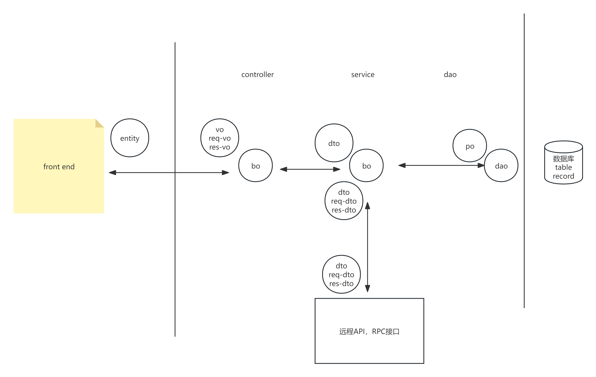

# 层间数据模型

po（persistent object）
直接代表数据库表中的数据，与数据库字段一一对应，纯数据无方法

dao（data access object）
数据访问层对象，负责读写数据库的对象，纯方法，可能有状态，但是无数据，dao是面向po进行运行的

orm（object relationship mapping）
使用操作对象的语法来操作数据库，封装程度非常高的数据对象，将复杂的数据库访问操作向开发者屏蔽。

dto（data transfer object）
一般作为跨越进程之间的数据传输，或者是在后端中层与层之间的数据传输

bo（bussiness object）
包含了处理业务逻辑的方法对象，一般是纯方法，可能有状态

vo（view object）
页面数据对象，前后端交互时用来传输数据的

注意，dto，po，vo都是传递数据的，它们有来去的区别，

vo原则上都要定义两遍，一个是去，一个是回的，加上前缀Req，或者Res，如UserReqVo，UserResVo，前者表示前端向后端请求时，所需要填写的参数或请求体的内容，后者表示后端向前端返回数据时的对象的类型，vo定义可以在Controller层。前端开发时，需要定义后端响应时的数据对象entity——User（对应了上面的UserResVo），回复的可以不定义，因为前端的类型自由。

po是确定的，无需定义两遍。

dto比较复杂，一般建议service无论多少层，都尽量保持一致，只定义一遍即可，这样可以减少层间转换，甚至可以把dto，直接当做res-vo。甚至再懒一点，将po当作dto，vo-res、vo-req。但是这样的话，业务一复杂就招架不住了。

## 充血模型和贫血模型