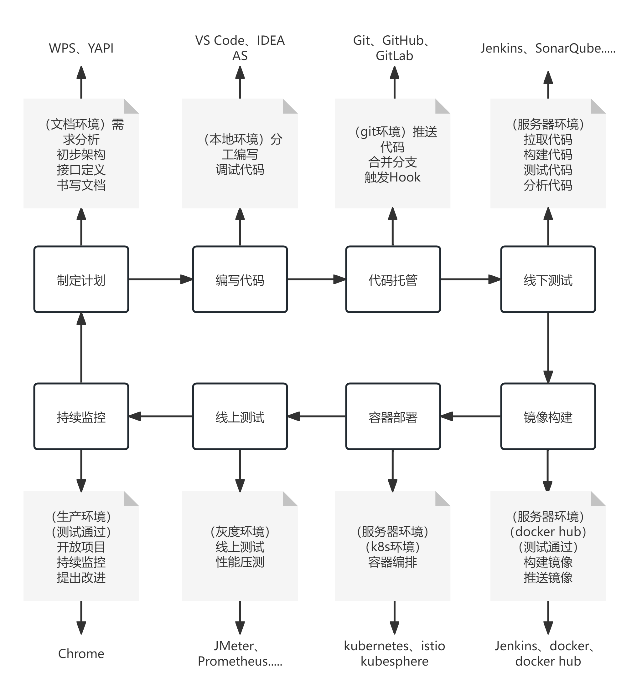
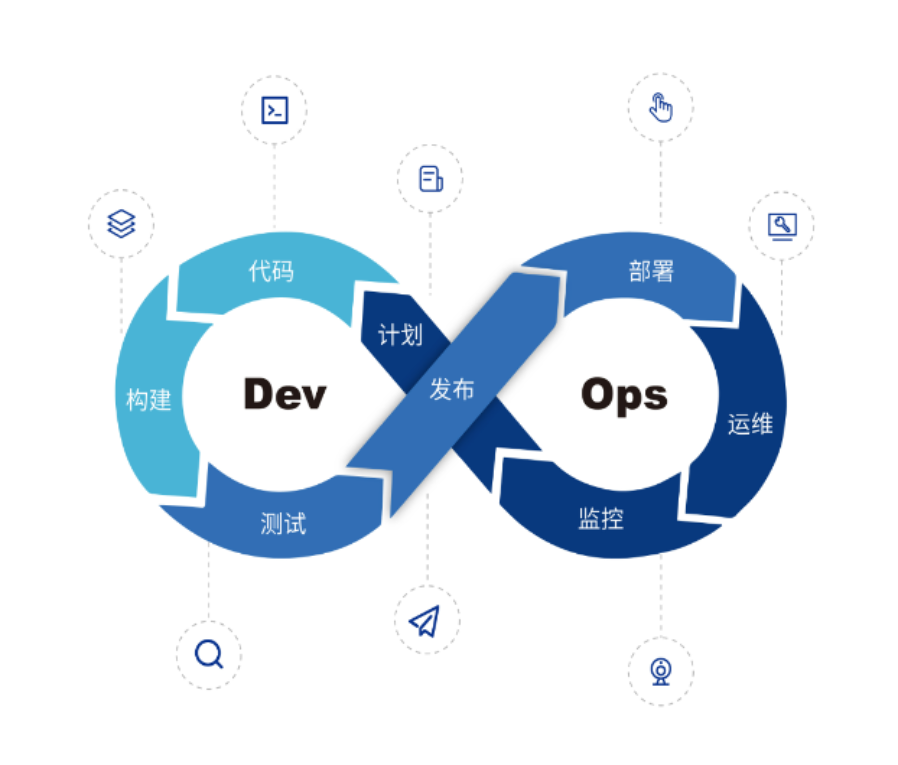
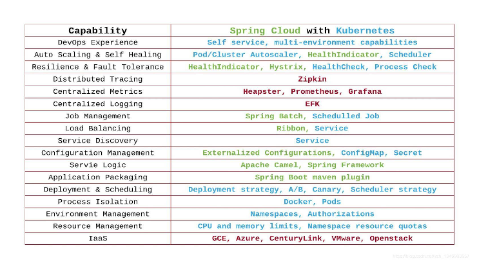
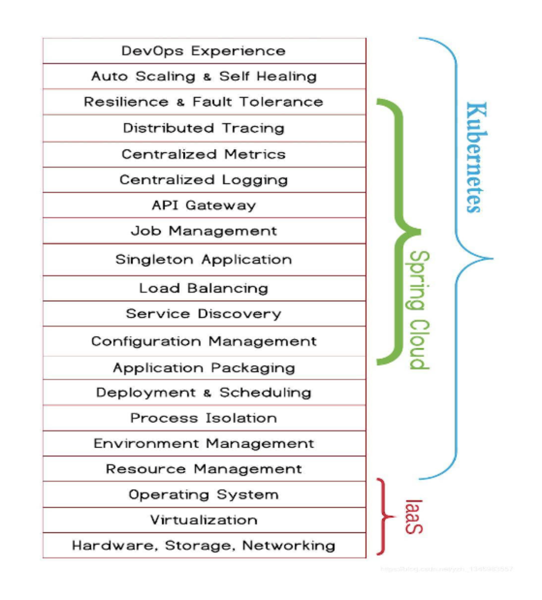
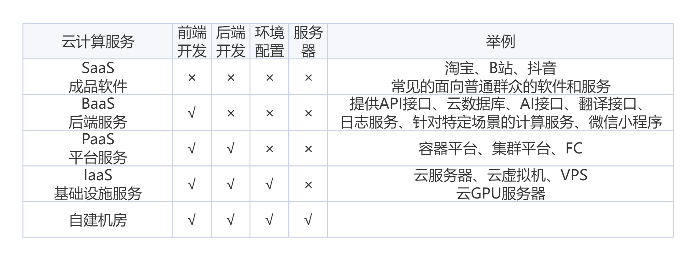

# DevOps
本着降本增效，开源节流的美好愿景，开发人员逐渐不再需要运维——一个人就能搞定的问题不需要两个人。

## 根据项目的规模选择合适的devOps方案
对于小型项目来说，人员、工期、资金没有一个是不紧的，流程要简单，但是要能够突出自动化，节约时间和人力成本，最多采用的流程：本地开发、本地测试、推送代码、code review、gitlab cd（夜间部署）、评估、修改。中大型项目可以走完完整的devops流程。

## 传统的微服务架构vs云原生架构
docker的虚拟化技术拉开了云原生架构的序幕，kubernetes也取得了云原生时代事实性标准的地位。云原生技术将原本在后端开发的内容下沉到基础设施上，使得开发业务和运维管理进一步分工，细化了和明确了各自的边界。由于其出色的自动化能力，一定程度上，它不仅干掉了大量的运维，还干掉了一部分后台开发的人员，虽然kubernetes是基础设施层的应用，但是对上层的后台开发造成了不小的影响，它间接与后台的很多分布式架构的微服务组件竞争上岗，导致一些分布式微服务的组件遭到挤兑，如下图。传统分布式组件能干的，kubernetes能干，传统分布式组件不能干的，kubernetes还能干。

kubernetes还具有一个非常重要的优势就是语言无关。传统的微服务架构几乎锁死了Java和Spring Cloud，这样造成了Java一支独大的局面，而今天的kubernetes架构俨然提出了不一样的看法。总结就是，云原生架构对传统微服务架构的挑战性是很激烈的，云原生架构是未来必然的结果。

## 云原生对前端的影响
云原生的出现极大地促进了云计算的发展。按照云计算厂商提供的云计算资源的封装程度，可以将云计算资源分为以下的类型

从下至上，自由度逐渐降低，但是使用更加方便，服务封装的程度越高。在一定程度上，如果前端人需要专注于页面的开发，那么，前端人可以购买相应的后台服务，并且直接使用云厂商的后台组件进行数据存储，无需担心后台的实现和网络攻击，由云厂商来进行开发和维护。这也就是所谓的Serverless，专注于前端开发，而无需考虑后端实现的冗余细节。

