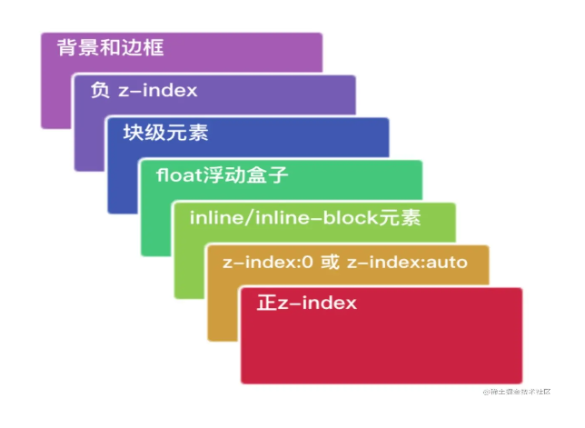

# 层叠上下文与z-index
两个元素的图层决定着元素显示的上下关系，上层的元素将覆盖下层的元素进行显示。决定图层关系的CSS属性为z-index，z-index越大，元素的显示优先级越高。

## z-index比较方法
+ 首先先看要比较的两个元素是否处于同一个SC中，如果是，谁的层叠等级大，谁在上面；
+ 如果两个元素不在同一SC中，先比较他们的父SC，当两个元素层叠水平相同、层叠顺序相同时，在 DOM 结构中后面的元素层叠等级在前面元素之上；
+ 如果一个元素拥有CS则在普通元素之上

普通的元素层级如图示：

## 层叠上下文的产生
层叠上下文的创建有两种情况，一种是强制创建，一种是可选创建。
+ 强制创建：
   1. 文档的根元素，如html；
   2. position设置为fix、sticky；
   3. opacity<1；
   4. mix-blend-mode不为normal；
   5. isolation=isolate；
   6. 使用了CSS3的动画特性，例如：filter、transform、will-change、clip-path……
   
+ 可选创建：指定z-index不为auto；在此基础上，z-index的
   1. position设置为relative、absolute；
   2. flexbox和grid的子元素；
   > 另外，position不为none 的时候同时会创建一个偏移上下文。