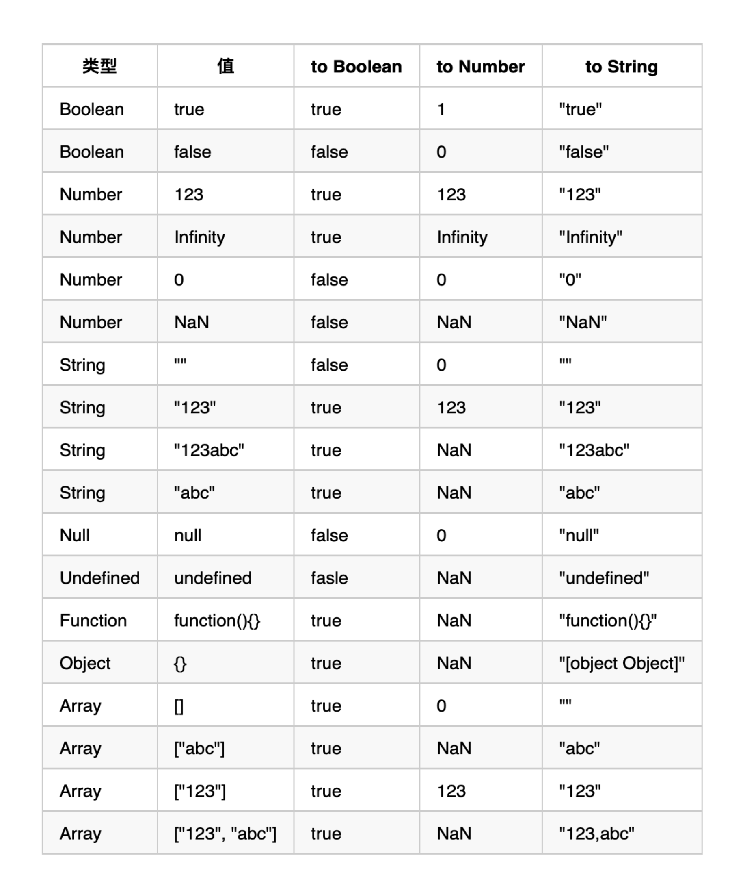

# 隐式类型转换

7 种基本类型：boolean、number(0、NaN、Infinity)、string、bigint、symbol、undefined、null，前五个为实值，后两个为空值

## 四种类型转换方法

1. toBoolean：

   undefined、null、0、NaN、''，会被转化为 false，其它为 true；
   推荐触发：!()

2. toNumber：

   undefined->NaN、null->0、NaN->NaN、Infinity->Infinity、''->0、true->1、false->0、'42'->42(此处与 parseFloat 不同，字符串解析失败为 NaN)
   推荐触发：+()

3. toString：

   调用 toString()方法将任意一个值转换为 string，
   推荐触发：()+''

4. toPrimitive：（潜在）

   先调用 valueOf()方法，如果得到了一个基本类型，则返回，否则调用 toString()，强制转换为 string 类型

## 隐式类型转换位置

1. 在一个需要单个 bool 值的地方，if()、while()、!()、for、&&、|| 等，发生 toBoolean 转换。
2. 被 -、\*、/ 单或双操作作用时，和 + 单操作作用时，（1）如果有引用类型则先发生 toPrimitive 转换；（2）而后发生 toNumber 转换。
3. 被 + 双操作作用时，（1）如果有引用类型则进行 toPrimitive 转换；（2）如果其中一侧是 String 类型，那么另一侧就会发生 toString 转换；（3）否则，发生 toNumber 转换。
4. 在 == 操作符作用时，
   （1）如果两侧为引用类型，则比较指针，指针相同返回 true，不同为 false。
   （2）如果一侧为引用类型一侧为基本类型，则引用类型发生 toPrimitive 转换。
   （3）如果若为不同类型，则将其中的实值进行 toNumber 转换。
   （4）比较，实值实值直接比，实值比空值为 false，空值比空值为 true。
   （注意：undefined==null 为 true，NaN==NaN 为 false）

