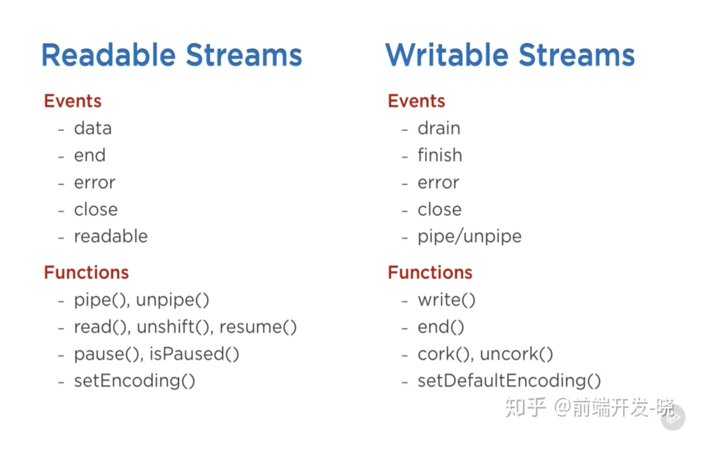

# Stream API

## ReadableStream
获得生产者
（1）new ReadableStream({
    start?(ctrl){
   ctrl.enqueue(data)
},
    pull?(ctrl){}
})
（2）从其他API获得

使用生产者
（1）对接至WriteableStream，rs.pipeTo(ws)
（2）调用reader，手动消费，
reader=rs.getReader()
reader.read().then((res)=>process(res))

## WriteableStream：消费者
获得消费者
（1）new WriteableStream({
    write(data){}
})

使用消费者
（1）让Readable对接
（2）手动调用writer，
writer=ws.getWriter()
writer.ready.write()

## node:stream.Readable
获得生产者
（1）new Readable({
    read(){
    this.push(chunk)
}
})
（2）从其他API获得，文件流，标准流，网络流，压缩流
（3）从可迭代对象获取，Readable.from(iterable)

使用生产者
（1）对接至Writeable，rs.pipe(ws)
（2）监听data事件
（3）监听readable事件，并且手动调用rs.read()方法消费值，这种情况下，流式静止的，必须循环调用read()
（4）使用node:stream/promise的pipeline()，流编排函数

生产者有静止状态、流动状态和关闭状态，初始为静止状态，在调用了pipe和被监听了data事件后变为流动状态

## node:stream.Writeable
获得消费者
（1）new Writeable({
    write(chunk,encoding,cb){
    process(chunk)
    cb()
}
})
（2）从其他API获得，文件流，标准流，网络流，压缩流

使用消费者
（1）让Readable对接
（2）监听drain事件
（3）监听writeable事件，手动调用ws.write()生产值
（4）pipeline

消费者有静止状态、流动状态和关闭状态，初始为静止状态，被对接pipe和被监听了drain事件后变为流动状态

