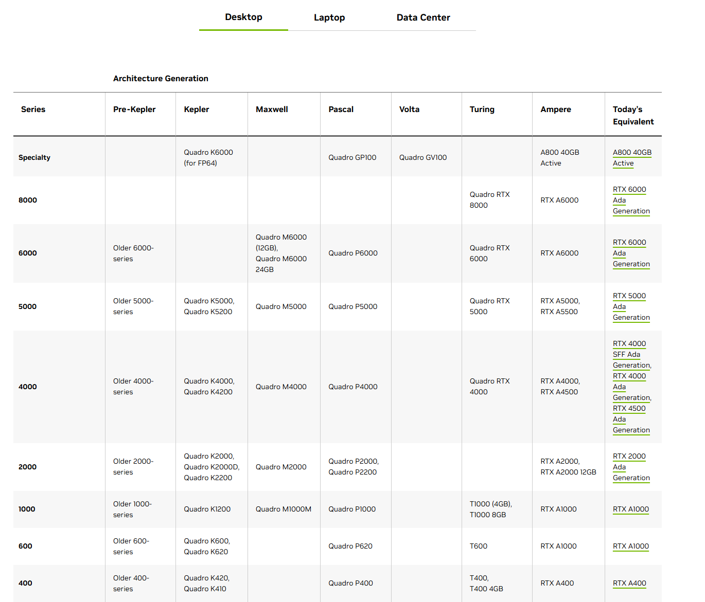
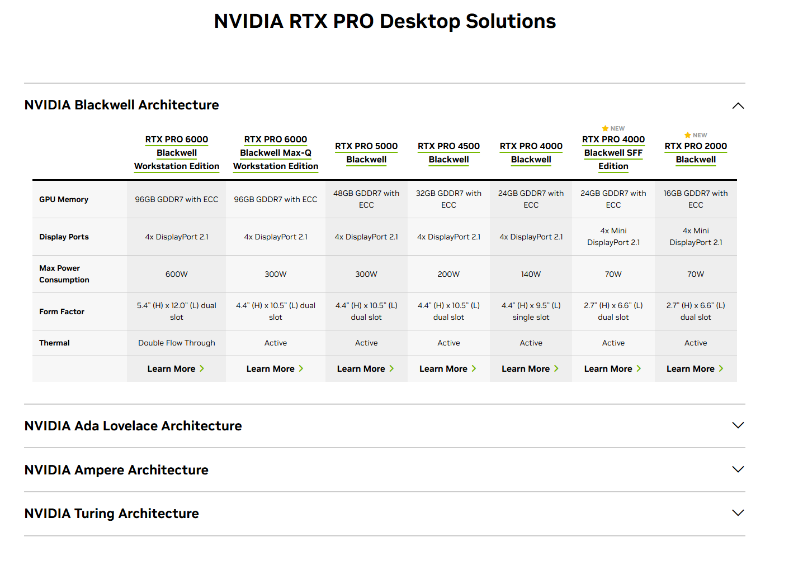

# GPU
GPU（Graphics Processing Unit，图形处理器）已经成为现代计算机的核心组件，无论是游戏娱乐、内容创作还是 AI 计算，GPU 的性能都直接影响整体体验。对于 DIY 装机爱好者来说，选择合适的 GPU 需要在性能、价格、功耗和用途之间找到平衡点。

目前 GPU 市场呈现寡头格局，NVIDIA 和 AMD 占据消费级市场主导地位，Intel 作为新入局者正在追赶。国产 GPU 厂商近年来发展迅速，但在消费级市场仍处于起步阶段。

## 市场格局
- 显卡核心设计者：Nvidia、AMD、Intel，Nvidia 占 90%，AMD 占 9%。
- AIC 厂商：AIC（Add-In Card）厂商，七彩虹、技嘉、华硕、微星等采购芯片，设计并制造完整显卡，包括 PCB、散热器、供电模块和 BIOS 调优。
- 零件供应商
  - 晶圆代工厂：TSMC（台积电）为主，生产 GPU 芯片（3nm/5nm 工艺）。
  - 内存供应商：三星、美光、SK 海力士，提供 GDDR6X/HBM4 等显存。
  - PCB 制造商：如 Foxconn、Pegatron，生产电路板。
  - 散热方案商：如 Delta、Cooler Master，提供风扇/水冷散热。
  - 电源组件供应商：如 TI、Infineon，提供 VRM、MOSFET 等。
- 组装厂：如纬创、和硕，负责显卡组装。
- 分销商/零售商：如京东、Newegg，将显卡销售给消费者。

## 核心参数
显存是 DIY 玩家最关注的参数之一。显存大小决定了能够处理的运算规模，大型 3A 游戏（4K 分辨率下）和本地运行大型 AI 模型（如 LLaMA 13B）往往需要 12GB 以上的显存。显存带宽则直接影响数据传输速度，带宽越高，高分辨率下游戏掉帧的可能性越小，AI 模型推理速度也越快。

计算性能方面，FLOPS（每秒浮点计算次数）衡量 GPU 的图形渲染和科学计算能力，FP32 性能直接影响游戏帧率；TOPS（每秒万亿次操作）衡量 AI 推理性能，INT8/FP16 算力决定了本地运行 AI 模型的速度。对于游戏玩家来说，FP32 性能和光追性能更重要；对于 AI 开发者，TOPS 和显存大小是关键指标。

功耗同样需要重点关注。TDP（热设计功耗）反映了显卡的功耗和散热需求，高端显卡如 RTX 5090 的 TDP 可达 500W 以上，这意味着需要 850W 甚至更高的电源，以及机箱内良好的风道设计。对于 ITX 小机箱用户，选择低功耗显卡更为实际。

其他值得关注的参数包括 GPU 架构（如 NVIDIA Blackwell、AMD RDNA 4）、核心频率、CUDA 核心数/流处理器数量、显存类型（GDDR6X vs HBM）和位宽、以及制造工艺（4nm/5nm）。这些参数共同决定了显卡的理论性能上限。

## 应用场景
游戏场景对 GPU 的要求主要集中在光栅化性能和光追性能上。1080p 分辨率下，RTX 4060/4070 级别即可流畅运行大多数游戏；2K 分辨率建议 RTX 4070 Ti 或 RX 7800 XT 以上；4K 分辨率则需要 RTX 4080 或 RX 7900 XTX 这样的旗舰产品。光追性能方面，NVIDIA 的 RTX 系列优势明显，AMD 的光追性能正在追赶但仍有差距。需要注意的是，开启光追会大幅降低帧率，建议配合 DLSS 或 FSR 超分辨率技术使用。

AI 场景对 GPU 的需求与游戏不同。本地运行 AI 模型（如 Stable Diffusion、LLaMA）更看重显存大小和 AI 算力，而非图形渲染能力。RTX 3090/4090 这样的旗舰显卡拥有 24GB 显存，适合运行中等规模的 AI 模型；专业级 RTX 6000 Ada 拥有 48GB 显存，可以运行更大的模型。对于纯 AI 应用，也可以考虑企业级显卡如 Tesla 系列，但需要解决驱动和散热问题。AI 训练通常需要多卡并行，NVIDIA 的 NVLink 技术可以提供更高的卡间通信带宽。

内容创作场景对 GPU 的要求介于游戏和 AI 之间。视频剪辑、3D 渲染需要均衡的图形性能和显存，RTX 4070/4070 Ti 是性价比较高的选择；专业级别的视频制作和 3D 设计建议考虑 RTX 专业显卡，它们提供经过 ISV 认证的驱动和稳定性，但价格要高出许多。

## 基准测试
评估 GPU 性能需要结合多个测试项目。3DMark Time Spy 是最常用的图形基准测试，可以评估 DX12 性能；Port Royal 测试光追性能；这些测试分数可以直接反映游戏性能。对于 AI 性能，可以使用 Geekbench Compute、MLPerf 等通用计算测试，或者直接运行实际的 AI 模型（如 Stable Diffusion）进行推理速度测试。

需要注意的是，基准测试分数只是参考，实际体验还取决于 CPU、内存、散热等因素。对于 DIY 装机，建议参考实际游戏的帧率测试，而非仅仅看理论分数。同时，不同品牌的显卡（如华硕、微星、七彩虹）在散热、超频能力和噪音控制上存在差异，这些都会影响实际使用体验。

## Nvidia 常见型号
Nvidia 目前市场的主力是 Blackwell 系列和 Ada Lovelace 系列，Ampere 系列正在逐步退出。Hopper 系列是专注于企业级市场。

| 架构      | 年代  | 核心突破            | 主要应用方向    |
| --------- | ----- | ------------------- | --------------- |
| Blackwell | 2025- | FP4 + 超大集群      | AI 训练/推理    |
| Hopper    | 2022- | Transformer Engine  | 大模型训练      |
| Ada       | 2022- | 光追 + DLSS 3       | 游戏 + 专业渲染 |
| Ampere    | 2020- | TF32 + MIG          | AI + 数据中心   |
| Turing    | 2018- | 实时光追            | 游戏光追时代    |
| Volta     | 2017- | Tensor Core         | AI 加速器元年   |
| Pascal    | 2016- | ——                  | ——              |
| Maxwell   | 2014- | ——                  | ——              |
| Kepler    | 2012- | CUDA 生态成熟的起点 | ——              |

### 消费级 Geforce
Geforce RTX 型号专注于消费级市场。其中 RTX 50X0 系列属于 Blackwell，RTX 40X0 系列属于 Ada Lovelace 系列，30X0 属于 Ampere 系列。

| 型号     | 架构      | 显存  | FP32 TFLOPS |
| -------- | --------- | ----- | ----------- |
| 5090     | Blackwell | 32    | 105         |
| 5080     | Blackwell | 16    | 56          |
| 5070 Ti  | Blackwell | 16    | 44          |
| 5070     | Blackwell | 12    | 31          |
| 5060 Ti  | Blackwell | 16,8  | 24          |
| 5060     | Blackwell | 8     | 20          |
| 5050     | Blackwell | 8     | 13          |
| 4090     | Lovelace  | 24    | 83          |
| 4080 S   | Lovelace  | 16    | 52          |
| 4080     | Lovelace  | 16    | 48          |
| 4070 TiS | Lovelace  | 16    | 44          |
| 4070 Ti  | Lovelace  | 12    | 40          |
| 4070 S   | Lovelace  | 12    | 35          |
| 4070     | Lovelace  | 12    | 29          |
| 4060 Ti  | Lovelace  | 16,8  | 22          |
| 4060     | Lovelace  | 8     | 15          |
| 3090 Ti  | Ampere    | 24    | 40          |
| 3090     | Ampere    | 24    | 35.6        |
| 3080 Ti  | Ampere    | 12    | 34          |
| 3080     | Ampere    | 12,10 | 30          |
| 3070 Ti  | Ampere    | 8     | 21.7        |
| 3070     | Ampere    | 8     | 20.3        |
| 3060 Ti  | Ampere    | 8     | 16.2        |
| 3060     | Ampere    | 12,8  | 12.7        |
| 3050     | Ampere    | 8     | 9.1         |
| 2080 Ti  | Turing    | 11    | 13.4        |
| 2080 S   | Turing    | 8     | 11.1        |
| 2080     | Turing    | 8     | 10.6        |
| 2070 S   | Turing    | 8     | 9.1         |
| 2070     | Turing    | 8     | 7.5         |
| 2060 S   | Turing    | 8     | 7.2         |
| 2060     | Turing    | 6     | 6.5         |

玩本地 AI 部署，3090 是值得关注的一张卡，支持双卡组 nvlink，且二手价格 ok，可以考虑。

**阉割版**

5090D 为中国特供版，显存仍为 32GB，主要阉割算力与显存带宽；5090D v2 改为阉割显存（降至 24GB）但算力放开到接近 5090 水平

| 型号     | 架构      | 显存 | FP32 TFLOPS | 实际性能定位    |
| -------- | --------- | ---- | ----------- | --------------- |
| 5090D    | Blackwell | 32   | 104         | 接近国际版 5090 |
| 5090D v2 | Blackwell | 24   | 104         | 略弱于 v1       |
| 4090D    | Lovelace  | 24   | 73          | 接近国际版 4090 |

**魔改版**

| 型号    | 架构     | 显存 |
| ------- | -------- | ---- |
| 4090    | Lovelace | 48   |
| 4090D   | Lovelace | 48   |
| 4080    | Lovelace | 32   |
| 3080    | Ampere   | 20   |
| 2080 Ti | Turing   | 22   |

2080 Ti 有双卡 nvlink。

### 专业级 Quadro

RTX 专业级，专注于图形工作站等领域，也可以用来训练 AI。

| 型号     | 系列      | 显存 | FP32 TFLOPS |
| -------- | --------- | ---- | ----------- |
| PRO 6000 | Blackwell | 96   | 125         |
| PRO 5000 | Blackwell | 48   | 65          |
| PRO 4000 | Blackwell | 24   | ~37-46      |
| PRO 3000 | Blackwell | 12   | ~29         |
| PRO 2000 | Blackwell | 16   | ~17         |
| PRO 1000 | Blackwell | 8    | ~13-14      |
| PRO 500  | Blackwell | 6    | ~9          |
| 6000 Ada | Lovelace  | 48   | 91          |
| 5000 Ada | Lovelace  | 32   | 65          |
| 4000 Ada | Lovelace  | 20   | 26.7        |
| A6000    | Ampere    | 48   | 38.7        |
| A5500    | Ampere    | 24   | ~22-34      |
| A5000    | Ampere    | 24   | 27          |
| A4500    | Ampere    | 20   | 23          |
| A4000    | Ampere    | 16   | 19          |
| A2000    | Ampere    | 12   | 8           |
| A1000    | Ampere    | 8    | ~6.7        |
| A400     | Ampere    | 4    | ~2.7        |

### 企业级 Tesla
当前 Hopper 架构是市场中的主力。

| 型号      | 系列      | 显存   | FP32 TFLOPS |
| --------- | --------- | ------ | ----------- |
| B300      | Blackwell | 288    | -           |
| B200      | Blackwell | 192    | -           |
| B100      | Blackwell | 192    | -           |
| GB200 NVL | Blackwell | 192 GB | -           |
| H200      | Hopper    | 141    | -           |
| H100 NVL  | Hopper    | 94     | -           |
| H100      | Hopper    | 80     | 51          |
| H100 PCIe | Hopper    | 80     | -           |
| H20       | Hopper    | 96     | -           |
| L40S      | Lovelace  | 48     | 91          |
| L40       | Lovelace  | 48     | 45          |
| L20       | Lovelace  | 48     | -           |
| L4        | Lovelace  | 24     | 30          |
| L2        | Lovelace  | 24     | -           |
| A100      | Ampere    | 40/80  | 19          |
| A40       | Ampere    | 48     | -           |
| A30       | Ampere    | 24     | 10          |
| A10       | Ampere    | 24     | 31          |
| T4        | Truing    | 16     | 31          |
| V100S     | Volta     | 32     | -           |
| GV100     | Volta     | 32     | -           |
| V100      | Volta     | 16/32  | -           |
| Titan V   | Volta     | 12     | -           |

**阉割版本**

| 型号 | 原版对应  | 系列      | 显存  | FP32 TFLOPS |
| ---- | --------- | --------- | ----- | ----------- |
| B40  | B100/B200 | Blackwell | 192   | -           |
| H20  | H100      | Hopper    | 96    | -           |
| H800 | H100      | Hopper    | 80    | -           |
| A800 | A100      | Ampere    | 40/80 | 19          |

## AMD 常见型号
AMD 是 NVIDIA 的主要竞争对手，在消费级市场以性价比优势著称，特别是在传统光栅化性能上往往能提供更高的每美元性能。AMD 的劣势在于光追性能和 AI 算力，CUDA 生态的缺失也使得 AMD 显卡在专业领域应用受限。但对于纯游戏玩家，AMD 显卡是值得考虑的选择。

### 消费级 Radeon
Radeon RX 9000 系列基于 RDNA 4 架构，RX 7000 系列基于 RDNA 3 架构。AMD 的策略是在相似价位下提供比 NVIDIA 更多的显存和更强的传统渲染性能。

| 型号        | 架构   | 显存     | 定位 / 特点                   |
| ----------- | ------ | -------- | ----------------------------- |
| RX 9070 XTX | RDNA 4 | 20       | RDNA 4 旗舰（顶级4K）         |
| RX 9070 XT  | RDNA 4 | 16       | 高端4K/光追主力               |
| RX 9070     | RDNA 4 | 12/16 GB | 高端主流                      |
| RX 9070 GRE | RDNA 4 | 12/16 GB | **中国特供**，性价比旗舰      |
| RX 9060 XT  | RDNA 4 | 16       | 中高端（2K/4K甜点）           |
| RX 9060     | RDNA 4 | 12 GB    | 中端主流                      |
| RX 7900 XTX | RDNA 3 | 24       | 上一代旗舰，仍很强            |
| RX 7900 XT  | RDNA 3 | 20       | 上一代高端                    |
| RX 7900 GRE | RDNA 3 | 16       | **中国特供**，性价比高        |
| RX 7800 XT  | RDNA 3 | 16       | 2K 高帧甜点卡（最受欢迎之一） |
| RX 7700 XT  | RDNA 3 | 12       | 2K 中端                       |
| RX 7600 XT  | RDNA 3 | 16       | 1080p/2K 高性价比             |
| RX 7600     | RDNA 3 | 8        | 1080p 主流                    |
| RX 7500 XT  | RDNA 3 | 8 GB     | 入门级（新增）                |

AMD 显卡的优势在于传统游戏性能和价格，但光追性能弱于 NVIDIA，AI 算力也明显不足。对于不追求光追和 AI 应用的纯游戏玩家，AMD 显卡是性价比之选。

玩本地 AI 部署，7900xtx 是值得关注的一张卡，有 24GB 显存，可以考虑组多卡工作站。

### 专业级 Radeon Pro
Radeon Pro 系列面向专业工作站市场，提供经过 ISV 认证的驱动和稳定性。

| 型号        | 架构   | 显存 | 应用场景             |
| ----------- | ------ | ---- | -------------------- |
| W7900       | RDNA 3 | 48   | 8K 视频编辑、3D 渲染 |
| W7800       | RDNA 3 | 32   | 中高端工作站         |
| W7600/W7500 | RDNA 3 | 8    | 入门级工作站         |

### 企业级 Instinct
Instinct 系列专注于数据中心和高性能计算，主要竞争对手是 NVIDIA Tesla。AMD 的优势在于开放生态（支持 ROCm、OpenCL），价格相对较低，但软件生态不如 CUDA 成熟。

| 型号   | 架构   | 显存 | 应用场景         |
| ------ | ------ | ---- | ---------------- |
| MI355X | CDNA 4 | 288  | 大模型训练       |
| MI350X | CDNA 4 | 288  | 数据中心 AI 训练 |
| MI350P | CDNA 4 | 144  | PCIe 形态        |
| MI325X | CDNA 3 | 256  | HPC 和 AI        |
| MI300X | CDNA 3 | 192  | HPC 和 AI        |
| MI300A | CDNA 3 | 128  | APU 形态         |
| MI250X | CDNA 2 | 128  | HPC 和 AI        |
| MI250  | CDNA 2 | 128  | HPC 和 AI        |
| MI210  | CDNA 2 | 64   | HPC 和 AI        |

## 国产 GPU 厂商
国产 GPU 厂商近年来发展迅速，主要分为三类：专注消费级图形的公司、专注 AI 算力的公司、以及专注军工/政府市场的公司。目前国产 GPU 在消费级市场仍处于追赶阶段，但在特定领域（如 AI 推理、工控显示）已经有所突破。

### 华为昇腾 Ascend
华为昇腾是华为自研的 AI 芯片系列，专注于云端 AI 训练和推理，是目前国产 AI 芯片中商业化最成功、生态最完善的产品线。昇腾芯片基于华为自研的达芬奇架构，采用 3D Cube 计算引擎，针对矩阵运算进行了深度优化。

**产品线：**：昇腾 910 系列是旗舰训练芯片，昇腾 310 系列是入门推理芯片。最新的昇腾 910B 采用 7nm 工艺，FP16 算力可达 320 TFLOPS，INT8 算力可达 640 TOPS，性能对标 NVIDIA A100。昇腾 910C 是升级版本，算力进一步提升。昇腾 310P 系列主要用于边缘推理，功耗仅 8W，适合摄像头、工控设备等场景。

**生态支持：**：华为提供了全栈 AI 软件生态，包括 CANN（Compute Architecture for Neural Networks）计算架构、MindSpore 深度学习框架、ModelArts 开发平台等。华为还推出了"算子开发工具"，方便开发者将 CUDA 算力迁移到昇腾平台。实际迁移过程中仍需要一定工作量，但华为提供了详细的技术支持。

**市场应用：**：昇腾芯片在国产化替代项目中应用广泛，包括智慧城市、安防监控、金融风控、科研计算等领域。在国产超算中心，昇腾芯片是主要选择之一。华为还推出了"昇腾智算"云服务，开发者可以通过华为云使用昇腾算力，无需购买硬件。

**主要优势：** 算力强劲、生态完善、华为提供端到端技术支持、国产化替代的首选方案。昇腾 910B 在大模型训练上的表现接近 A100，在 LLaMA、GPT 等大模型微调任务上表现良好。

**局限性：** 昇腾芯片专注于 AI 计算，图形渲染能力支持较弱，不适合游戏或图形应用；CUDA 生态迁移需要时间；供应链受美国制裁影响，但华为通过国内代工厂解决了生产问题。

### 摩尔线程 Moore Threads
摩尔线程是目前国产 GPU 中最受关注的厂商之一，成立于 2020 年，团队来自 NVIDIA 等公司。摩尔线程采用"图形 + AI"双轮驱动策略，产品线覆盖消费级显卡和企业级 AI 加速卡。

**消费级产品：** 壁挂卡系列（如 MTT S70、MTT S80）。MTT S80 拥有 4096 个 MUSA 核心、16 显存，性能大致相当于 GTX 1050 Ti 水平。摩尔线程显卡的优势在于价格低廉（S80 约 ¥1000），支持 DirectX、OpenGL、Vulkan 等主流图形 API。

**主要问题：** 驱动不够成熟，游戏兼容性较差，性能发挥不稳定。摩尔线程正在积极优化驱动，但与 NVIDIA/AMD 相比仍有较大差距。适合对游戏性能要求不高的办公、显示和多屏输出场景。

**企业级产品：** 夸娥系列（如 S3000、S4000）专注于 AI 推理和视频处理，在国产化替代项目中有一定应用。

### 其他厂商
+ 砺算科技。
  砺算科技成立于 2021 年，主打自研 GPU 架构，目标是国产高性能显卡。砺算曾发布"锋"系列 GPU，声称性能可达 RTX 3060 水平，但实际产品落地较慢，消费级显卡在市场上较为少见。砺算的技术积累主要来自前 AMD 和 Intel 工程师，架构设计具有一定潜力，但商业化进程仍在推进中。
+ 寒武纪 Cambricon。
  寒武纪专注于 AI 芯片，产品线包括终端处理器（MLU 系列）、边缘推理芯片和云端训练芯片。寒武纪的 MLU370、MLU590 等产品在国产 AI 推理市场有一定应用，支持 INT8/FP16 混合精度计算。寒武纪的优势在于成熟的工具链（支持 TensorFlow、PyTorch），但图形渲染能力有限，不适合游戏或图形应用。
+ 南京沐曦 Maxxiri。
  沐曦成立于 2020 年，专注于高性能 GPU 芯片设计，产品面向数据中心、AI 加速和图形渲染市场。沐曦采用自研架构，已推出 MXN 系列 GPU，主要面向 AI 推理和训练场景。沐曦的优势在于支持 CUDA 兼容（通过翻译层），可以在一定程度上利用 NVIDIA 的软件生态，但性能和兼容性仍需时间验证。
+ 景嘉微。
  景嘉微是国产 GPU 领域的先行者，成立于 2006 年，专注于军工和政府市场。景嘉微的 JM 系列显卡（如 JM9 系列）主要用于工控显示、指挥中心等特定场景，通过国产化认证，在这些领域有稳定的采购需求。**特点：** 可靠性高、通过军工认证、长期供货保证。但性能较弱，JM9 系列大致相当于 GT 630 水平，无法满足现代游戏或 AI 计算需求。景嘉微的价值在于国产化替代，而非性能竞争。
+ 壁仞科技。
  壁仞科技成立于 2019 年，专注高端 AI 芯片，产品 BR100/BR104 采用自研架构，峰值算力可达 400 TFLOPS（FP16），对标 NVIDIA A100。壁仞的优势在于 AI 训练和推理性能，但受限于美国制裁，先进工艺代工受阻，商业落地面临挑战。壁仞主要面向数据中心和企业级市场，消费级产品暂无明确计划。
