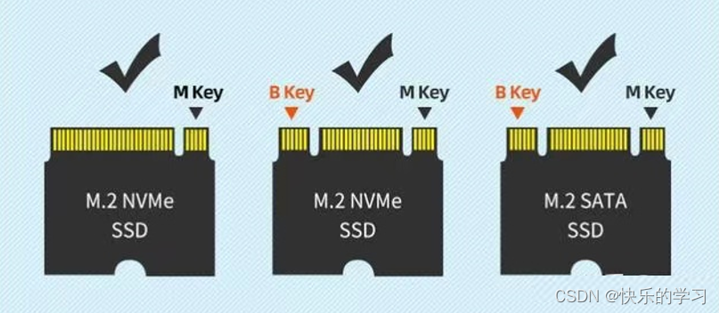

# 主板
消费级的主板主要用途针对游戏场景，搭载一个 x16 的显卡 PCIe 插槽，并且支持 CPU 直连；企业级的主板强调可扩展性和可靠性，具有较多的内存插槽（通常 8~24 条 DIMM）和 PCIe 插槽（通常 4~10 条），且全部支持 ECC 内存和远程带外管理（BMC/IPMI）。

## 主板常见参数
| 参数               | 核心含义                           | 为什么关注                                         |
| ------------------ | ---------------------------------- | -------------------------------------------------- |
| CPU 插座（Socket） | 物理接口                           | 插座不匹配 = 无法安装 CPU                          |
| 供电相数（VRM）    | CPU 供电模块                       | 超频/高功耗 CPU 稳定性                             |
| 芯片组（Chipset）  | 决定 CPU 支持、PCIe 通道、超频能力 | 错芯片组 = CPU 装不上；高端芯片组解锁更多 PCIe/M.2 |
| 内存支持           | 类型/频率/通道/容量                | 影响多任务、游戏帧数；DDR5 已主流                  |
| PCIe 插槽          | 版本 × 通道数                      | 显卡/SSD/扩展卡带宽瓶颈                            |
| M.2 插槽           | SSD 接口数量/规格                  | 系统盘+游戏盘速度                                  |
| 后置 I/O           | USB/网口/音频                      | 外设连接                                           |
| 扩展槽             | SATA/PCIe 小槽                     | 机械硬盘/声卡/采集卡                               |
| BIOS 功能          | 超频/调试                          | 后期优化                                           |
| 尺寸/布局          | Form Factor                        | 机箱兼容 + 走线                                    |

## CPU 适配性
主板的型号首先受限于 CPU，不同的 CPU 需要使用的主板互不相同。因此，Intel CPU 和 AMD CPU 必须使用完全不同的主板，不能混用，选择主板时，应该先选择 CPU。

1. 插座，不同的 CPU 使用不同的插座，即使是同一个公司的不同的 CPU 插座也不一定相同。AMD 的插槽一般是 AM5，intel 的插槽一般是 LGA 1700。
2. CPU 供电相数 VRM，指 CPU 供电单元的数量，一般的 PC 级供电单元，每个可以提供 20 W 的供电，主板上包含多个 CPU 供电单元，多个单元的总供电数量要能够 cover CPU 的 TDP（Thermal Design Power, CPU 满载设计功率）；

## 芯片组
也称为南桥（Platform Controller Hub），总管计算机的外设。芯片组通过**扩展总线通道**和 CPU 进行交互，区分于 CPU 的直连通道。

对于 intel 来说，扩展总线通道使用了一种专用的总线协议 DMI 总线，而 AMD 则依旧使用的是 PCIe 通道

```
   ┌──────────────┐
   │    CPU       │
   │  ├──16× PCIe5 GPU
   │  ├──4×  PCIe4 NVMe
   │  └─── DMI4.0 x8 ─────┐
   └──────────────┘        │
                            ▼
                  ┌───────────────────┐
                  │       PCH         │
                  │ USB / SATA / PCIe │
                  │ 网卡 / 声卡等控制器 │
                  └───────────────────┘

```

## 插槽形状
在目前的消费级 PC 主板上，有不同类型的外设插槽类型。
> 注意 CPU 使用 CPU 插槽，内存使用 DDR 插槽。一般的消费级主板，CPU 插槽是 1个，内存插槽是 4 个。

### PCIe 插槽
单个 PCIe5 的通道带宽是 4GiB/s，单个 PCIe4 的通道带宽是 2GiB/s。一些设备的带宽要求较高，可以将多个通道进行合并，从而被同一个设备所使用。接口形似一个钥匙。


典型的通道合并规格有：
+ x1：网卡、声卡、WiFi 卡
+ x4：NVMe SSD 硬盘、Thunderbolt 卡、10G 网卡
+ x8：双卡桥接、AI 加速卡
+ x16：显卡、高性能计算卡

常见的 PCIe 设备
| 设备类型       | 推荐规格 | 带宽需求    | 示例产品                                    |
| -------------- | -------- | ----------- | ------------------------------------------- |
| GPU            | x16      | ≥32 GiB/s   | RTX 4090 / 5090                             |
| NVMe SSD       | x4       | 8-16 GiB/s  | 三星 990 PRO (Gen4) / 致态 TiPro9000 (Gen5) |
| 10G/25G 网卡   | x4       | ≥5 GiB/s    | Mellanox ConnectX-6                         |
| Thunderbolt 卡 | x4       | 5 GiB/s     | 华硕 ThunderboltEX 4                        |
| WiFi 卡        | x1       | <1 GiB/s    | Intel BE200                                 |
| RAID 扩展卡    | x4/x8    | 10-30 GiB/s | 华硕 Hyper M.2 x16                          |
| 专业采集卡     | x8/x16   | 20+ GiB/s   | Blackmagic DeckLink 8K                      |

### M.2 插槽
常见的使用 M.2 插槽的设备，有 NVMe SSD 硬盘，下层使用的可以是 PCIe 总线协议、SATA 协议、USB 协议


插槽形态差异（Key Type），M.2 接口有不同的“缺口（Key）”设计，用来防止错误插入：
+ M Key：用于 NVMe SSD，支持 PCIe x4。
+ B Key：用于 SATA/PCIe x2/USB。
+ B+M Key：混合型 SSD，能在 B 或 M 插槽上都插。



### SATA 接口
主要用于老式的机械硬盘，形状形如 L 形。

### IO 背板
位于主板背面边缘，插入机箱后对应机箱后面板的开口。通常是一块长条形金属区域，有很多接口孔，用于外接各种设备。
+ 音频接口，3.5mm 音频口（Line-out、Mic-in、Line-in），有些高端板带 光纤输出（S/PDIF）
+ USB 接口，USB 2.0 / 3.0 / 3.1 / 3.2，有的板上还有 USB-C 接口
+ 网络接口（LAN），RJ45 网口，可能是 1G/2.5G/10G，高端板可能还有双网口或光纤接口
+ 视频输出接口（仅 CPU 带集显或板载显卡时有），HDMI、DisplayPort、VGA
+ PS/2 接口，有些板还保留老式键盘/鼠标接口
+ Wi-Fi / 蓝牙天线接口（天线螺母接口）

### 其他插槽
| 插槽名称       | 形状描述                  | 尺寸/针脚                | 用途          | 位置       | 示例设备           |
| -------------- | ------------------------- | ------------------------ | ------------- | ---------- | ------------------ |
| 前置面板头     | 小针脚阵列（2x5 或 2x10） | 9-19 针                  | 接机箱按钮/灯 | 主板右下   | Power SW / HDD LED |
| ARGB / RGB 头  | 小 3/4 针排针             | 3 针 (RGB) / 4 针 (ARGB) | 接灯条        | 主板边缘   | 风扇/灯带          |
| Thunderbolt 头 | 5 针小排针                | 5 针                     | 接 TB 扩展卡  | 主板下     | 华硕 TBEX 4        |
| COM 串口头     | 9 针排针                  | 9 针                     | 老设备调试    | 主板后 I/O | 工业串口           |
| TPM 头         | 2x7 或 2x10 排针          | 14/20 针                 | 安全模块      | 主板下     | TPM 2.0 模块       |
| 扇热头         | 小 3/4 针口               | 3 针 (DC) / 4 针 (PWM)   | 接风扇/水泵   | 主板四周   | 240 水冷泵         |
| ATX 电源头     | 大方块排针                | 24 针主 + 8 针 CPU       | 供电          | 主板右上   | 海盗船 RM850x      |
| PCIe 电源头    | 6/8 针方块                | 6+2 针                   | 给 GPU 供电   | 主板右     | RTX 4090 12VHPWR   |


## 常见主板型号
PCIe 通道决定显卡安装的数量；M.2 决定了硬盘安装的数量；

主板和 CPU 一般相适应，并且分为消费级、专业级和企业级，分为对应个人 PC、工作室的工作站、企业的服务器。

### intel 主板
intel 的 CPU 分为
+ intel Core
+ intel Xeon

| 芯片组 | 定位       | 超频支持   | 插槽     | pcie     |
| ------ | ---------- | ---------- | -------- | -------- |
| Z890   | 发烧/超频  | CPU + 内存 | LGA 1851 | PCIe 5.0 |
| Z790   | 发烧/超频  | CPU + 内存 | LGA 1700 | PCIe 5.0 |
| Z690   | 上代旗舰   | CPU + 内存 | LGA 1700 | PCIe 5.0 |
| H810   | 入门/稳定  | 否         | LGA 1851 | PCIe 4.0 |
| H770   | 企业/稳定  | 否         | LGA 1700 | PCIe 4.0 |
| B860   | 中端       | 内存       | LGA 1851 | PCIe 5.0 |
| B760   | 主流性价比 | 内存       | LGA 1700 | PCIe 4.0 |

> Z 高端/旗舰，Q 企业/商务，H 主流，B 入门，M 体积小但扩展性阉割
> 第一位数字，代际，第二位数字，级别
> LGA 1851 对应 800 系（Core Ultra），LGA 1700 对应 600/700 系（12-14 代 Core）；CPU 直连通道均为 PCIe 5.0，但 B760/H 系列主板常把显卡插槽降配为 PCIe 4.0 以节省成本

### AMD 主板
AMD 的 CPU 分为
+ Ryzen
+ Threadripper
+ EPYC

#### 消费级

> AMD 芯片组命名规则：X 高端，B 主流，A 入门，E 后缀表示扩展性增强。第一位数字代表代际，第二位数字代表级别。

**AM5 平台（当前，2022-）**

AM5 平台使用 LGA 1718 插座，支持 DDR5 内存和 PCIe 5.0，对应 Ryzen 7000/9000 系列 CPU。

| 芯片组 | 定位      | 超频支持 | 插槽 | pcie     |
| ------ | --------- | -------- | ---- | -------- |
| X870E  | 旗舰/发烧 | 是       | AM5  | PCIe 5.0 |
| X870   | 高端      | 是       | AM5  | PCIe 5.0 |
| B850   | 中高端    | 是       | AM5  | PCIe 5.0 |
| B840   | 主流      | 否       | AM5  | PCIe 4.0 |
| X670E  | 旗舰/发烧 | 是       | AM5  | PCIe 5.0 |
| X670   | 高端      | 是       | AM5  | PCIe 5.0 |
| B650E  | 中高端    | 是       | AM5  | PCIe 5.0 |
| B650   | 主流甜点  | 是       | AM5  | PCIe 4.0 |
| A620   | 入门      | 否       | AM5  | PCIe 4.0 |

> E 后缀（X670E/B650E）保证显卡插槽为 PCIe 5.0，无 E 的 B650 显卡槽多为 PCIe 4.0；B840/A620 则直接把 CPU 直连通道限制在 PCIe 4.0

**AM4 平台（上一代，2016-2022）**

AM4 是 AMD 历史上生命周期最长的消费级平台，使用 PGA 1331 插座，横跨 Zen 1 到 Zen 3 四代架构（Ryzen 1000/2000/3000/5000 系列），全部使用 DDR4 内存。

| 芯片组 | 定位       | 超频支持 | 插槽 | pcie     |
| ------ | ---------- | -------- | ---- | -------- |
| X570   | 旗舰/发烧  | 是       | AM4  | PCIe 4.0 |
| B550   | 主流甜点   | 是       | AM4  | PCIe 4.0 |
| X470   | 上代旗舰   | 是       | AM4  | PCIe 3.0 |
| B450   | 主流性价比 | 是       | AM4  | PCIe 3.0 |
| X370   | 初代旗舰   | 是       | AM4  | PCIe 3.0 |
| B350   | 初代主流   | 是       | AM4  | PCIe 3.0 |
| A520   | 入门       | 否       | AM4  | PCIe 3.0 |
| A320   | 入门       | 否       | AM4  | PCIe 3.0 |

> X570 是唯一芯片组端也支持 PCIe 4.0 的 AM4 平台，通常配有芯片组主动散热风扇；B550 仅 CPU 直连通道（显卡 + 第一个 M.2）支持 PCIe 4.0，芯片组通道为 PCIe 3.0；300/400 系芯片组来自芯片组的 PCIe 通道均为 2.0，A520/A320 不支持 CPU 超频
> Ryzen 5000 系列仅 X570/B550/A520 官方原生支持（400 系主板可通过 Beta BIOS 兼容，300 系大多不支持）

#### 专业级

专业级（工作站）平台处于消费级和企业级之间，面向科学计算、影视渲染、AI 训练、EDA 仿真等需要大量 PCIe 扩展和高内存带宽的工作负载。与消费级 Ryzen 相比，Threadripper 提供 4~8 通道内存（vs 双通道）和 48~128 条 PCIe 5.0 直连通道（vs 24~28 条），虽然单核性能与同期 Ryzen 持平，但多核吞吐量和 I/O 扩展能力有数量级的差异。与企业级 EPYC 相比，Threadripper 保留了超频支持（除部分 Pro 型号外）和更高的单核频率，且可以使用消费级的散热器和机箱——代价是不支持多路互联和部分 RAS（Reliability, Availability, Serviceability）特性。

**命名规则**

Threadripper 使用四位/五位数字 + 后缀的命名体系，以 7995WX 和 7980X 为例拆解：

`7` — **代际**，7 = 7000 系列 (Zen 4 / Storm Peak)、5 = 5000 系列 (Zen 3 / Chagall)、3 = 3000 系列 (Zen 2 / Castle Peak)、9 = 9000 系列 (Zen 5 / Shimada Peak)。

`99 / 98` — **核心数档次**，99 为 96 核旗舰，98 为 64 核，97 为 32 核，96 为 24 核，95 为 16 核，94 为 12 核。与 EPYC 不同，Threadripper 的核心数档位和实际核心数严格对应。

`5 / 0` — **产品线细分**，5 标记为 Pro 产品线（WX），0 标记为标准 HEDT 产品线（X）。这是区分 Pro 和非 Pro 的最直观标志——第三位数字是 5 的就是 Pro 型号。

后缀区分：
+ `X` 后缀（如 7980X）：HEDT 产品线，4 通道内存，支持超频，插在 TRX50 主板上，面向个人高性能工作站。
+ `WX` 后缀（如 7995WX）：Pro 产品线，8 通道内存，支持 RDIMM/ECC，AMD PRO 安全管理套件，插在 WRX90 主板上，面向企业级工作站和影视后期工作室。

以 7995WX 验证规则：7 = Zen 4 代际 + 99 = 96 核旗舰 + 5 = Pro 产品线 + WX 后缀 = 顶级工作站。实际参数为 96C/192T、8 通道 DDR5-5200、128 条 PCIe 5.0、384 MB L3、TDP 350W——完全符合命名预期。

**平台演进史**

Threadripper 的平台发展经历了一次重大的路线分化，理解这段历史有助于看懂当前的产品布局：

| 代际     | 年份 | 架构  | 产品线          | 插座  | 芯片组      | 内存         | PCIe       |
| -------- | ---- | ----- | --------------- | ----- | ----------- | ------------ | ---------- |
| 1000     | 2017 | Zen 1 | HEDT+工作站合一 | TR4   | X399        | 4ch DDR4     | 66×3.0     |
| 2000     | 2018 | Zen+  | HEDT+工作站合一 | TR4   | X399        | 4ch DDR4     | 66×3.0     |
| 3000     | 2019 | Zen 2 | HEDT            | sTRX4 | TRX40       | 4ch DDR4     | 88×4.0     |
| 3000 Pro | 2020 | Zen 2 | 工作站          | sWRX8 | WRX80       | 8ch DDR4     | 128×4.0    |
| 5000 Pro | 2022 | Zen 3 | 工作站          | sWRX8 | WRX80       | 8ch DDR4     | 128×4.0    |
| 7000     | 2023 | Zen 4 | HEDT + 工作站   | sTR5  | TRX50/WRX90 | 4ch/8ch DDR5 | 48~128×5.0 |
| 9000     | 2025 | Zen 5 | HEDT + 工作站   | sTR5  | TRX50/WRX90 | 4ch/8ch DDR5 | 80~128×5.0 |

在 Zen 1/Zen+ 时代（1000/2000 系列），HEDT 和工作站使用同一套 TR4/X399 平台，4 通道内存对两类用户都够用。到了 Zen 2 时代（3000 系列），AMD 第一次拆分了路线：sTRX4/TRX40 给 HEDT（4 通道、可超频），sWRX8/WRX80 给工作站（8 通道、支持 RDIMM、不可超频）。这次拆分合理——工作站用户需要的是 ECC RDIMM 和 2 TB 内存上限，而 HEDT 用户更看重超频和性价比。

但 sTRX4/TRX40 的生命周期引发了不少争议——AMD 从未在 TRX40 上推出 Zen 3 的 5000 系列非 Pro CPU，这个平台只服务了一代产品就被实质放弃。sWRX8/WRX80 的表现要好得多，先后支持了 Zen 2 (3000 Pro) 和 Zen 3 (5000 Pro) 两代。

到了 Zen 4 时代（7000 系列），AMD 重新统一为 sTR5 插座，用两档芯片组区分定位：TRX50（4 通道、可选 Pro CPU 但降配运行）和 WRX90（8 通道、仅支持 Pro CPU）。Zen 5 的 9000 系列继续沿用 sTR5 插座，为已有 TRX50/WRX90 主板提供了代际升级空间。

**TRX50 vs WRX90 核心差异**

虽然共享同一个 sTR5 插座，两块主板的定位有本质区别：

| 维度              | TRX50                              | WRX90                           |
| ----------------- | ---------------------------------- | ------------------------------- |
| CPU 兼容          | 非 Pro + Pro（Pro 降配运行）       | 仅 Pro（WX 后缀）               |
| 内存通道          | 4 通道 DDR5 (RDIMM/UDIMM)          | 8 通道 DDR5 (RDIMM)             |
| 最大内存          | 1 TB (9000 系列)                   | 2 TB                            |
| CPU 直连 PCIe 5.0 | 48 条（7000 系）/ 80 条（9000 系） | 128 条                          |
| 典型 GPU 槽数     | 2~4 条 x16                         | 6~7 条 x16                      |
| 超频              | 支持 CPU + 内存                    | 支持（部分功能受限）            |
| BMC/IPMI 远程管理 | 无                                 | 有（AST2600）                   |
| AMD PRO 安全套件  | 无                                 | Memory Guard / Secure Processor |
| 典型价格          | $600~$1000                         | $1000~$2000                     |

TRX50 的 4 通道内存在绝大多数渲染和编译场景中已经足够——实际测试中，从 4 通道升级到 8 通道对 V-Ray、Blender Cycles、Cinebench 这类负载的提升通常不超过 5%。真正需要 8 通道带宽的是计算流体力学（CFD）、大规模矩阵运算和需要 1 TB+ 内存的 EDA 仿真——这些场景基本是 WRX90 的独占领域。GPU 扩展方面，TRX50 可以带 2~3 块显卡（每块 x16/x8 拆分），而 WRX90 的 128 条 PCIe 5.0 确保 7 块 GPU 全跑在 x16 速率——多 GPU 深度学习训练和 GPU 渲染集群基本只能选 WRX90。

一个有趣的省钱策略是：在 TRX50 主板上安装 Pro CPU（如 7995WX）。96 核全核心可用，但内存通道被限制为 4 条，PCIe 通道也被裁剪。对于 CPU 密集但内存带宽不敏感的任务（如编译 Chromium、Houdini 粒子解算），这种搭配的性价比远高于 WRX90。

**与消费级、企业级的边界**

Threadripper 的定位可以这样总结：

消费级的 AM5 平台类似一辆高性能轿车——日常驾驶足够快，装载能力有限（双通道内存、最多 2~3 块 M.2 SSD）。Threadripper 之于 Ryzen 类似一辆重型皮卡，装载能力和拖拽能力大幅提升，但单圈速度并没有更快（单核性能持平）。EPYC 则是真正意义上的 18 轮重卡——为了多任务吞吐量和可靠性牺牲了峰值频率，只能在数据中心这个"高速公路"上行驶。

在实际选型中，有个常见的误区值得注意：不少人认为"核心越多越好"，忽略了内存带宽与核心数的匹配关系。例如 96 核的 7995WX 插在 TRX50 上的 4 通道内存配置，每个核心只能分到约 5.2 GB/s 的带宽——对于流式数据处理（如视频转码、数据库扫描），内存带宽可能比核心数更早成为瓶颈。而同样 96 核在 WRX90 的 8 通道下，每核带宽翻倍至 10.4 GB/s。判断是否需要 8 通道的最简单方法是：运行应用时观察内存带宽利用率，如果 4 通道下持续接近理论带宽上限，那么升级到 8 通道才会有感知的提升。

#### 企业级

企业级服务器主板服务于数据中心、云计算和高性能计算场景，与消费级主板的设计思路有本质区别——服务器主板采用 SoC（System-on-Chip）架构，CPU 直接集成内存控制器、PCIe 根复合体、SATA/USB 控制器和安全协处理器，不再需要传统的南桥芯片组。一个低速的外置 BMC（Baseboard Management Controller，基板管理控制器）芯片负责带外管理（IPMI/Redfish）、远程 KVM、虚拟介质挂载等运维功能。

企业级平台的核心差异体现在三个方面：内存通道数量（决定总带宽）、PCIe 通道数量（决定扩展能力）、以及是否支持多路互联（决定单节点的算力上限）。以 Genoa 平台为例，12 通道 DDR5 提供 460 GB/s 的理论内存带宽，128 条 PCIe 5.0 通道可同时驱动 8 块 GPU 和 24 块 NVMe 硬盘——这些都是消费级平台无法企及的扩展规模。

**EPYC 处理器命名规则**

AMD EPYC 使用四位数字 + 可选后缀的命名体系，以 7601 为例拆解：

`7` — **产品系列**，7 代表 7000 系列（SP3 平台），9 代表 9000 系列（SP5 平台），8 代表 8000 系列（SP6 边缘计算平台）。

`6` — **核心数档位**，数字越大核心越多但并不精确等于数量，只表示所属的核心数区间。7001 (Naples) 代际的实际对应关系为：2 = 8 核 (7251/7261)、3 = 16 核 (7301/7351)、4 = 24 核 (7401/7451)、5 = 32 核 (7501/7551)、6 = 32 核旗舰款 (7601)。到了 7002/7003 代际核心数整体上移，6 对应到 48~64 核区间。所以解读核心数档位时必须结合第四位的代际数字一起看。

`0` — **性能/定位细分**，在同一核心数档位内区分高低配。第三位数字越大概率上代表更高的主频或更大的缓存配置。例如 7601 的核心数档位为 6（32 核），定位细分 0 意味着它是 32 核中的标准性能款；如果是 6 则属于同核心数下的高频/高性能款。

`1` — **架构代际**，1 = Zen 1 (Naples)、2 = Zen 2 (Rome)、3 = Zen 3 (Milan)、4 = Zen 4 (Genoa/Bergamo/Siena)、5 = Zen 5 (Turin)。这是命名中最重要的单字符——它直接决定了 IPC、能效比和指令集支持（如 AVX-512 从 Zen 4 开始引入）。

后缀用于标记特殊能力：
+ `P` 后缀（如 7551P）：仅支持单路（1P），不能用于双路服务器，但通常价格更低。
+ `F` 后缀（如 9374F）：高频优化款，面向单线程延迟敏感型负载（如高频交易、EDA 仿真）。
+ `X` 后缀（如 7773X）：搭载 3D V-Cache，在 CCD 上堆叠额外 L3 缓存，适用于计算流体力学、EDA 等对缓存容量极度敏感的工作负载。Milan-X 的 3D V-Cache 将 L3 从 256 MB 提升至 768 MB。
+ `S` 后缀（如 9754S）：面向云原生/高密部署，使用 Zen 4c 密集核心，在相同功耗下塞入更多核心。

以 7601 为例验证这条规则：7 系列 + 6=32 核 + 0=标准性能定位 + 1=Zen 1 架构 + 无后缀=支持双路。7601 实际参数为 32C/64T、基频 2.2 GHz、TDP 180W、8 通道 DDR4-2666、128 条 PCIe 3.0——完全符合命名规则给出的预期。

**企业级平台代际**

企业级 CPU 代际与对应的主板平台：

| CPU 代际 | 代号            | 典型型号          | 主板平台 | 制程    | 关键特性                                             |
| -------- | --------------- | ----------------- | -------- | ------- | ---------------------------------------------------- |
| 7001     | Naples          | 7601、7551、7401  | SP3      | 14nm    | Zen 1, DDR4, PCIe 3.0, 最多 32 核                    |
| 7002     | Rome            | 7742、7702、7452  | SP3      | 7nm     | Zen 2, DDR4, PCIe 4.0, 最多 64 核, 引入 chiplet 架构 |
| 7003     | Milan / Milan-X | 7763、7713、7773X | SP3      | 7nm     | Zen 3, DDR4, PCIe 4.0, 可选 3D V-Cache               |
| 9004     | Genoa / Bergamo | 9654、9754、9374F | SP5      | 5nm     | Zen 4/Zen 4c, DDR5, PCIe 5.0, CXL 1.1+, 最多 128 核  |
| 9005     | Turin           | 9965、9845        | SP5      | 4nm/3nm | Zen 5/Zen 5c, DDR5-6000, 最多 192 核                 |
| 8004     | Siena           | 8234、8534P       | SP6      | 5nm     | Zen 4c, 6ch DDR5, 96 条 PCIe 5.0, 专为边缘/电信设计  |

**企业级主板平台（Socket）**

+ SP3 (LGA 4094)：AMD 的第一代可扩展服务器插座，覆盖 Zen 1 到 Zen 3 三代架构（2017-2022）。这个平台最突出的特点是三代 CPU 共享同一插座——从 Naples 到 Milan，一块 SP3 主板可以通过 BIOS 更新跨越三代 CPU。8 通道 DDR4 和 128 条 PCIe 4.0 的规格在推出时远超同代 Intel Xeon 平台。SP3 是目前数据中心中保有量最大的 EPYC 平台。
+ SP5 (LGA 6096)：为 Zen 4/Zen 5 设计的旗舰平台（2022-），插座物理尺寸 76×80 mm，是三个平台中最大的一档。12 通道 DDR5（Genoa 4800 MT/s，Turin 6000 MT/s）和 160 条 PCIe 5.0 通道使其成为 HPC 和 AI 训练场景的主力。支持双路互联和 CXL 1.1+（64 条 lane 可配置为 CXL），TDP 上限在 Turin 代达到 500W。Genoa 到 Turin 保持插座兼容，为已有 SP5 基础设施提供了原地升级路径。
+ SP6 (LGA 4844)：面向边缘计算和电信场景的低功耗平台（2023-）。插座物理尺寸与 SP3 相同（58.5×75.4 mm），但引脚数增至 4844。仅支持单路，6 通道 DDR5 和 96 条 PCIe 5.0 的规格仅为 SP5 的一半，对应地 TDP 可低至 70W。SP6 的关键价值在于能在电信机架、零售边缘节点等空间和散热受限的环境中提供 x86 服务器级别的可靠性和 ECC 内存支持，替代大量散落的 Xeon-D 设备。

SP3、SP5、SP6 三个插座之间物理和电气上互不兼容。换个说法，每换一代平台就需要更换主板和散热器。SP6 和 SP3 虽然尺寸相同（散热器孔位兼容），但引脚定义不同，不能混插 CPU。

**企业级主板厂商与板型**

目前企业级 EPYC 主板主要有两条路线：

1. 品牌服务器厂商定制板（Dell PowerEdge、HPE ProLiant、Lenovo ThinkSystem、Supermicro H12/H13 系列）：这些是整机方案，主板不可单独购买，但占据了数据中心的主要份额。Supermicro 是其中的例外——它同时出售裸主板和准系统，是自建服务器的主要渠道。

2. 零售企业级主板（ASRock Rack、Gigabyte、TYAN）：面向自建 NAS、虚拟化服务器、小型 HPC 集群的个人和中小型企业。典型产品如 ASRock Rack ROMED8-2T（SP3, ATX 板型）、Gigabyte MZ32-AR0（SP3, E-ATX 板型）。

企业级主板的板型方面，标准的 EEB（12×13 英寸）和 E-ATX 是零售市场最常见的尺寸，能装入多数 E-ATX 兼容的全塔机箱。品牌服务器则大量使用定制板型，走线和散热都针对特定机箱优化，几乎没有跨品牌互换的可能。