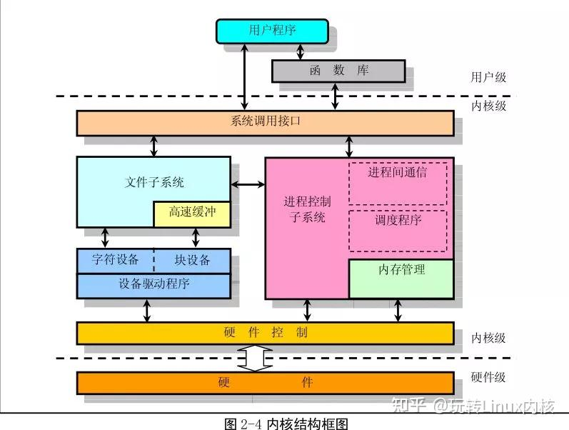

# linux 内核

## 内核体系结构

### 内核源码结构

### 中断机制
中断主要有软件中断和硬件中断两种。

## 内核引导

## 进程管理
进程是操作系统对一个独立执行的任务的管理单元。其代表了一个应用层程序的实例化对象，执行一个应用层的自定义程序。在程序的执行中，系统将为进程分配 CPU 资源，并为程序许诺一个独立而广阔的虚拟内存空间，供程序使用。

### 进程内存空间
进程的内存是操作系统许诺的一个虚假空间，分为两个部分，一部分是内核空间，一部分是用户空间，内核空间预先存放了操作系统为用户提供过的一些数据和信息，用户的代码和数据存放在用户空间，用户可以在自己的空间中执行程序，同时也可以调用内核空间中的函数，从而进入内核态，使用内核提供的 API 执行更加底层的操作，包括：IO 操作，硬件控制，系统控制等等。

## 内存管理

## 文件系统

## 驱动系统

## 网络协议栈
