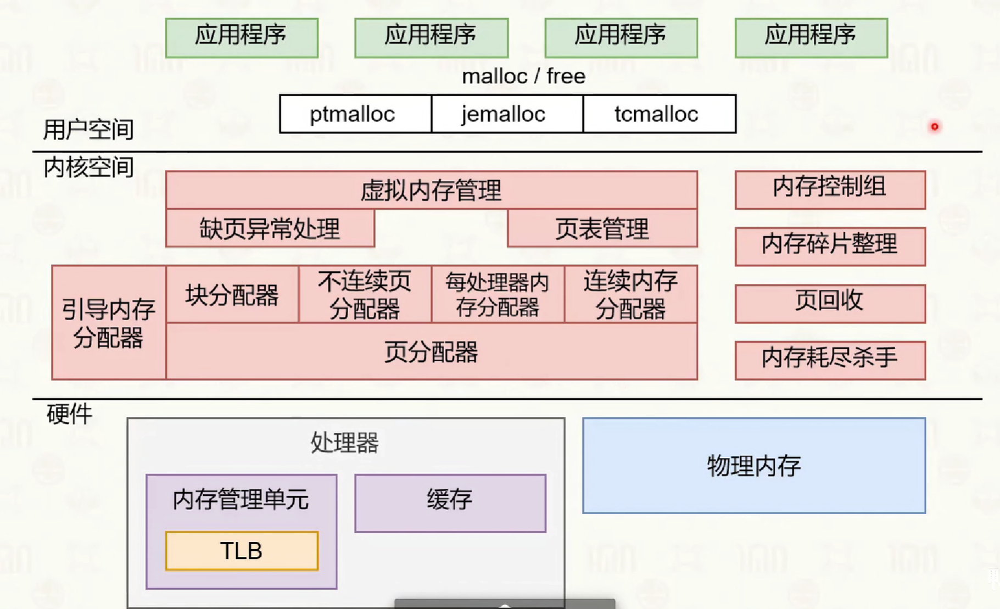

# 内存管理
操作系统为进程提供虚拟内存，每个应用程序进程都认为自己独占全部、连续的内存。在 64 位系统上：
- 虚拟内存大小为256TB
- 地址范围：0x0000_0000_00000000 到 0x0000_FFFF_FFFFFFFF，64 为数可以使用 16 个 16 进制数来表示，而由于 linux 中的虚拟内存范围其实最大不超过 0x0000_7fff_ffffffff，因此地址范围可以使用 12 位 16 进制数来简述：0x0000_00000000 0x7fff_ffffffff
  

虚拟内存的管理依附于进程管理。


虚拟内存的机制使得用户程序编写时无须关注底层的物理内存，同时，提供了进程之间的内存隔离能力和访问权限控制。但是，虚拟内存的引入导致了用户空间程序的内存申请延迟和访问延迟。

## 内存地址翻译
根据冯诺依曼模型，CPU 需要从硬盘加载数据，填入到内存中，然后再通过读写内存中的数据进行临时存储，最后将内存中的数据持久化到硬盘上。CPU 在访问内存的时候需要使用特定的内存操作相关指令，并需要指定操作的内存虚拟地址。

内存地址翻译是将进程的虚拟地址转换为物理地址的过程，依赖于硬件和操作系统的协作。主要涉及以下几个核心组件：
+ 内存基地址寄存器
  内存基地址寄存器（如 x86 架构的 CR3，ARM 架构的 TTBR）存放当前进程页表的物理基地址。每次进程切换时，操作系统会更新该寄存器，MMU 通过它定位页表，实现不同进程的虚拟内存空间隔离。
+ MMU
  MMU（Memory Management Unit）内存管理单元是 CPU 内部负责虚拟地址到物理地址转换的硬件模块。它根据当前进程的内存基地址寄存器中的值去获取页表信息，从而根据页表信息将虚拟地址分级映射到物理地址，实现内存隔离和保护。
  
  CPU 在执行任何需要读写内存的指令时，均需要通过其中的 MMU 来进行内存访问。而内存地址翻译是 MMU 的固定流程。意味着 CPU 只能使用虚拟地址、指令传参的时候是虚拟地址、CPU 内存相关的指令逻辑对物理地址不感知，负责从物理内存上取数据的是 MMU。**应用层的程序员只需要关注虚拟内存即可，而无须关注物理内存的管理**，并且操作系统其实也不需要具体地实现页表查询的算法，操作系统主要需要管理好 MMU 的映射规则和行为即可。
+ TLB
  多级页表虽然节省了内存空间，但会增加地址转换的访问延迟。为提升效率，CPU 内部集成了 TLB（Translation Lookaside Buffer，转址旁路缓存），用于缓存最近访问过的虚拟页到物理页的映射。TLB 是有限大小的高速缓存，命中时可直接获得物理地址，未命中时需重新查页表并更新 TLB。

## 内存分配
常见的虚拟内存管理算法有分段和分页。

### 分页
linux 系统的虚拟内存管理采用的是分页方式。不使用分段方式的理由是：分段方式容易产生**外部内存碎片**，造成内存浪费。

分页机制将内存条的内存地址空间分成一个个区间进行管理：**页**。在分配和管理内存的时候不是以一个一个字节为单位管理，而是以一个页为最小的操作和管理单位进行的，一个内存页通常包含 4K 个内存位置，一个位置存放一个 Byte。

对于一个进程来说，它的虚拟内存地址空间中的内存也同样使用分页的方式进行。进程的内存需要进行动态分配使用，按需申请，每次申请一个或者多个页表，每个虚拟页表都可以对应一个真实的物理地址中的页表。操作系统以进程为单位，为程序创建一个**内存地址映射表**，也叫**页表**，页表记录着从虚拟地址空间中的一个页的首地址，到对应的真实物理页的内存条上的首地址，的映射关系。

### 多级页表
简单地使用一个页表记录虚拟空间到物理空间的内存页映射关系，会面临一个问题是，页表占用了太多的空间，因为页表也需要占用内存。对于 32 位的系统页表需要占用 4MB，勉强接受；而 64 位的系统页表需要占用 33554432 GB 的空间，这个空间显然是无法接受的。可以使用多级页表解决这个问题。
```
2^32 / 4k * 4 = 4 MB
2^64 / 4k * 8 = 33554432 GB
```

多级页表是一个类似于字典树的结构，多级多分支，对于一个 64 位的虚拟内存地址空间中的地址，会先对其进行前缀划分，从而确定其在多级页表上的查找路径。前 16 位不可用，中间的 32 位作为中间地址，后 16 位作为页内偏移；进程中保存着页表基地址，即 0 级页表的地址，在进行进程切换的时候，将该地址写入页表基地址寄存器即可完成进程的页表切换。

在需要读取某个地址上的数据的时候，先根据该地址的中间 36 位按顺序读取 4 级页表找到物理页的首地址，然后根据页内偏移找到该字节的地址，然后读取数据。


多级页表中，0 级页表必定存在，然后 1 级页表不一定都存在，因为 0 级页表中的地址不一定都是有效值，同理 2，3 级页表不一定存在，只有当需要的时候触发缺页异常，由系统临时分配，由此可以节省内存的空间；

### TLB 缓存
多级页表是为了节省空间的，但它牺牲了内存读取的时间，因为增加了多级页表的机制，导致访问单次内存的时间大大增加。为了避免重复走多级页表，在 CPU 内部增加 TLB 单元，这是一个硬件单元，（Translation Lookaside Buffer 转址旁路缓存），用于缓存走完 4 级页表之后，哪些虚拟页已经成功与物理页映射过了。它是一个有限大小的哈希表缓存，过期算法由硬件级实现。

### 内存大页
为了减少多级页表造成的访问延迟，可以使用内存大页来解决。linux 默认的页表大小是 4K，使用四级缓存，它允许调整页的大小为 2M 和 1G，相对应的页表采用 3 级页表和 2 级页表。这样可以减少访问路径的深度，同时一次加载一大块内存，可以显著减少访问的次数，但是这样会造成**内部碎片**的产生。同时，大页可以增加 TLB 的命中率和减少过期计算。


## 用户态 malloc 流程
在一个进程中，虚拟地址空间被划分成一个个 4K 大小的虚拟页，分别可以与真实的内存条上的物理内存页一一对应。

```c
struct task_struct {
    pid_t pid;
    long state;
    struct mm_struct *mm;
    struct files_struct *files;
    struct task_struct *parent;
    struct list_head children;
    ...
};
```

当进程调用 malloc 申请内存时，Linux 的内存分配流程如下：
+ 映射
  用户程序发起内存分配请求。程序调用 malloc 函数申请内存，如果申请的内存小于 128KB，使用 brk 系统调用；如果申请的内存大于 128KB，使用 mmap 系统调用；但是不论大小如何，需要始终将内存按照分页进行管理。

  虚拟内存分配，内核在进程的虚拟地址空间中分配一段连续的虚拟内存，此时只分配虚拟地址空间，不分配实际的物理内存；在页表 `struct mm_struct *mm` 中创建对应的页表项，但标记为`不存在`。
+ 缺页异常
  首次访问触发缺页异常，当程序首次访问这段内存时，由于页表项标记为`不存在`，CPU 触发缺页异常（Page Fault），操作系统接管处理缺页异常，核心函数 `do_page_fault` 负责处理；

  物理内存分配，操作系统检查访问的虚拟地址是否合法，如果合法，分配物理内存页，更新页表，建立虚拟地址到物理地址的映射；将页表项标记为"存在"；

  TLB 更新，新的页表项被添加到 TLB 中，后续访问可以直接通过 TLB 快速获取物理地址，如果 TLB 已满，根据硬件算法淘汰旧项；
+ 访问
  内存访问，程序可以正常访问内存，如果访问的地址超出分配范围，触发段错误（Segmentation Fault）；

  内存释放，当调用 free 释放内存时，如果使用 brk 分配的内存，可能通过收缩堆来释放，如果使用 mmap 分配的内存，直接解除映射，对应的物理内存页被回收，页表项被标记为`不存在`，TLB 中的对应项被标记为无效；

这个过程体现了 Linux 内存管理的几个重要特性：
- 延迟分配：只有在实际使用时才分配物理内存
- 按需分页：通过缺页异常机制实现
- 写时复制：多个进程共享同一物理页，直到需要修改
- 内存回收：通过页面置换和内存压缩保持系统稳定

## 进阶主题
+ 内核页缓存（Page Cache）与缓冲区（Buffer Cache）
+ NUMA 架构
+ Cgroup 限制内存使用
+ Transparent HugePages（THP）
